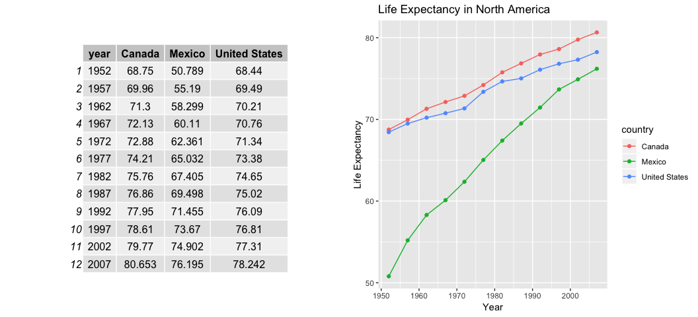
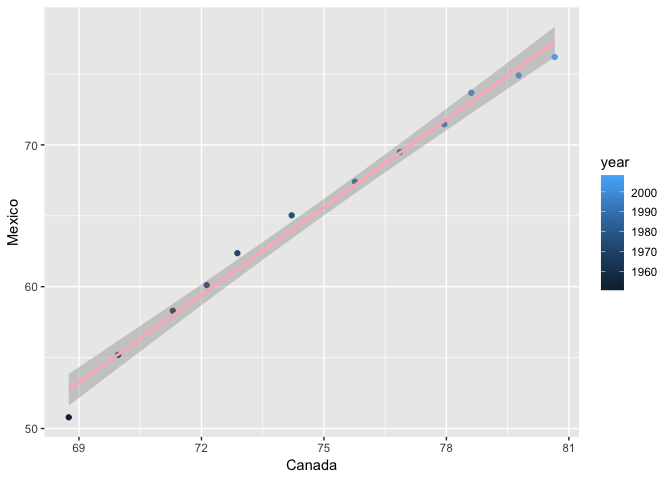
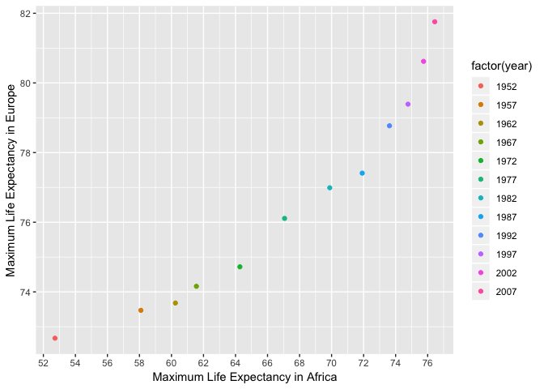
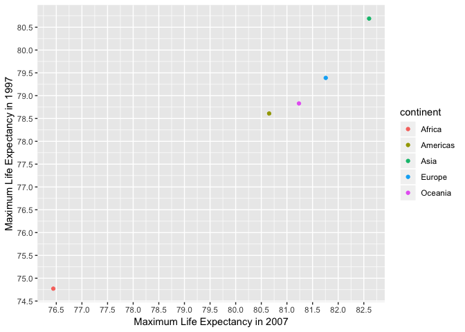

Alejandra\_hw04\_tidy\_data\_joins
================

## Tidy data and joins

This is an R Markdown document that has the objective of practicing and
strengthen data wrangling skills by working with some realistic problems
in the grey area between data aggregation and data reshaping.

According to Hadley Wickham, **Data Tidying** is structuring datasets to
facilitate analysis.

## Loading data and required libraries

``` r
library(gapminder)
library(dplyr)
library(tidyr)
library(kableExtra)
library(gridExtra)
library(ggplot2)
```

# Data Reshaping Prompts (and relationship to aggregation)

Using `gather()` and `spread()` functions to reshape data can be very
useful to present tables, figures or doing aggregations and statistical
analysis.

## Activity 2:

  - Make a tibble with one row per year and columns for life expectancy
    for two or more countries.

  - Use knitr::kable() to make this table look pretty in your rendered
    homework.

  - Take advantage of this new data shape to scatterplot life expectancy
    for one country against that of another.

For this activity, I will select the countries from North America:
Mexico, United States and Canada.

First let’s only look at the subset of life expectancy in these
countries:

``` r
#subset data from North America
NAmerica = gapminder %>%
  filter(country %in% c("Mexico", "United States", "Canada")) %>% 
  select(country, year, lifeExp)
  
#Put the subset in a table
  kable (NAmerica) %>%
  kable_styling(full_width = FALSE)
```

<table class="table" style="width: auto !important; margin-left: auto; margin-right: auto;">

<thead>

<tr>

<th style="text-align:left;">

country

</th>

<th style="text-align:right;">

year

</th>

<th style="text-align:right;">

lifeExp

</th>

</tr>

</thead>

<tbody>

<tr>

<td style="text-align:left;">

Canada

</td>

<td style="text-align:right;">

1952

</td>

<td style="text-align:right;">

68.750

</td>

</tr>

<tr>

<td style="text-align:left;">

Canada

</td>

<td style="text-align:right;">

1957

</td>

<td style="text-align:right;">

69.960

</td>

</tr>

<tr>

<td style="text-align:left;">

Canada

</td>

<td style="text-align:right;">

1962

</td>

<td style="text-align:right;">

71.300

</td>

</tr>

<tr>

<td style="text-align:left;">

Canada

</td>

<td style="text-align:right;">

1967

</td>

<td style="text-align:right;">

72.130

</td>

</tr>

<tr>

<td style="text-align:left;">

Canada

</td>

<td style="text-align:right;">

1972

</td>

<td style="text-align:right;">

72.880

</td>

</tr>

<tr>

<td style="text-align:left;">

Canada

</td>

<td style="text-align:right;">

1977

</td>

<td style="text-align:right;">

74.210

</td>

</tr>

<tr>

<td style="text-align:left;">

Canada

</td>

<td style="text-align:right;">

1982

</td>

<td style="text-align:right;">

75.760

</td>

</tr>

<tr>

<td style="text-align:left;">

Canada

</td>

<td style="text-align:right;">

1987

</td>

<td style="text-align:right;">

76.860

</td>

</tr>

<tr>

<td style="text-align:left;">

Canada

</td>

<td style="text-align:right;">

1992

</td>

<td style="text-align:right;">

77.950

</td>

</tr>

<tr>

<td style="text-align:left;">

Canada

</td>

<td style="text-align:right;">

1997

</td>

<td style="text-align:right;">

78.610

</td>

</tr>

<tr>

<td style="text-align:left;">

Canada

</td>

<td style="text-align:right;">

2002

</td>

<td style="text-align:right;">

79.770

</td>

</tr>

<tr>

<td style="text-align:left;">

Canada

</td>

<td style="text-align:right;">

2007

</td>

<td style="text-align:right;">

80.653

</td>

</tr>

<tr>

<td style="text-align:left;">

Mexico

</td>

<td style="text-align:right;">

1952

</td>

<td style="text-align:right;">

50.789

</td>

</tr>

<tr>

<td style="text-align:left;">

Mexico

</td>

<td style="text-align:right;">

1957

</td>

<td style="text-align:right;">

55.190

</td>

</tr>

<tr>

<td style="text-align:left;">

Mexico

</td>

<td style="text-align:right;">

1962

</td>

<td style="text-align:right;">

58.299

</td>

</tr>

<tr>

<td style="text-align:left;">

Mexico

</td>

<td style="text-align:right;">

1967

</td>

<td style="text-align:right;">

60.110

</td>

</tr>

<tr>

<td style="text-align:left;">

Mexico

</td>

<td style="text-align:right;">

1972

</td>

<td style="text-align:right;">

62.361

</td>

</tr>

<tr>

<td style="text-align:left;">

Mexico

</td>

<td style="text-align:right;">

1977

</td>

<td style="text-align:right;">

65.032

</td>

</tr>

<tr>

<td style="text-align:left;">

Mexico

</td>

<td style="text-align:right;">

1982

</td>

<td style="text-align:right;">

67.405

</td>

</tr>

<tr>

<td style="text-align:left;">

Mexico

</td>

<td style="text-align:right;">

1987

</td>

<td style="text-align:right;">

69.498

</td>

</tr>

<tr>

<td style="text-align:left;">

Mexico

</td>

<td style="text-align:right;">

1992

</td>

<td style="text-align:right;">

71.455

</td>

</tr>

<tr>

<td style="text-align:left;">

Mexico

</td>

<td style="text-align:right;">

1997

</td>

<td style="text-align:right;">

73.670

</td>

</tr>

<tr>

<td style="text-align:left;">

Mexico

</td>

<td style="text-align:right;">

2002

</td>

<td style="text-align:right;">

74.902

</td>

</tr>

<tr>

<td style="text-align:left;">

Mexico

</td>

<td style="text-align:right;">

2007

</td>

<td style="text-align:right;">

76.195

</td>

</tr>

<tr>

<td style="text-align:left;">

United States

</td>

<td style="text-align:right;">

1952

</td>

<td style="text-align:right;">

68.440

</td>

</tr>

<tr>

<td style="text-align:left;">

United States

</td>

<td style="text-align:right;">

1957

</td>

<td style="text-align:right;">

69.490

</td>

</tr>

<tr>

<td style="text-align:left;">

United States

</td>

<td style="text-align:right;">

1962

</td>

<td style="text-align:right;">

70.210

</td>

</tr>

<tr>

<td style="text-align:left;">

United States

</td>

<td style="text-align:right;">

1967

</td>

<td style="text-align:right;">

70.760

</td>

</tr>

<tr>

<td style="text-align:left;">

United States

</td>

<td style="text-align:right;">

1972

</td>

<td style="text-align:right;">

71.340

</td>

</tr>

<tr>

<td style="text-align:left;">

United States

</td>

<td style="text-align:right;">

1977

</td>

<td style="text-align:right;">

73.380

</td>

</tr>

<tr>

<td style="text-align:left;">

United States

</td>

<td style="text-align:right;">

1982

</td>

<td style="text-align:right;">

74.650

</td>

</tr>

<tr>

<td style="text-align:left;">

United States

</td>

<td style="text-align:right;">

1987

</td>

<td style="text-align:right;">

75.020

</td>

</tr>

<tr>

<td style="text-align:left;">

United States

</td>

<td style="text-align:right;">

1992

</td>

<td style="text-align:right;">

76.090

</td>

</tr>

<tr>

<td style="text-align:left;">

United States

</td>

<td style="text-align:right;">

1997

</td>

<td style="text-align:right;">

76.810

</td>

</tr>

<tr>

<td style="text-align:left;">

United States

</td>

<td style="text-align:right;">

2002

</td>

<td style="text-align:right;">

77.310

</td>

</tr>

<tr>

<td style="text-align:left;">

United States

</td>

<td style="text-align:right;">

2007

</td>

<td style="text-align:right;">

78.242

</td>

</tr>

</tbody>

</table>

Now, let’s make the data tidy by using `spread()` which turns a pair of
key-values into tidy columns. I will put the outpu in a table and I will
also make a plot with this new tidy data.

``` r
NAtable = NAmerica %>%
spread(key = country, value = lifeExp) #define key value pairs for new columns

NAplot = NAmerica %>%
  ggplot(aes(year, lifeExp, color = country)) +
  geom_point() +
  geom_line() +
  labs(x="Year", y="Life Expectancy", title= "Life Expectancy in North America") #add axis labels and title

grid.arrange(tableGrob(NAtable), NAplot, nrow = 1) #put table next to plot
```



`spread()` allowed tidying data by making a column for each country and
each observation in a row. This made it possible to do the above plot
easily. We can see that in early years, there was a huge gap between the
life expectancy of Mexico and the rest of North America. However, over
the years, life expectancy in Mexico increased and in 2007 it was not
too far behind from United States and Canada.

Now let’s compare life expectancy between US and Canada by making a
scatterplot:

``` r
g1 <- NAtable %>%
  ggplot(aes(x=Mexico, y=Canada)) +
  geom_point(aes(color= year)) +
  scale_y_continuous(breaks = seq(0,85,by=2)) + #adjust axis to read plot easier
  scale_x_continuous(breaks = seq(0,85,by=2)) +
  labs(x= "Life Expectancy in Mexico", y= "Life Expectancy in Canada") #change axis labels
  
g2 <- NAtable %>%
  ggplot(aes(x=Mexico, y=`United States`)) +
  geom_point(aes(color= year)) +
  scale_y_continuous(breaks = seq(0,85,by=2)) + #adjust axis to read plot easier
  scale_x_continuous(breaks = seq(0,85,by=2)) +
  labs(x= "Life Expectancy in Mexico", y= "Life Expectancy in US")
  
g3 <- NAtable %>%
  ggplot(aes(x=`United States`, y=Canada)) +
  geom_point(aes(color= year)) +
  scale_y_continuous(breaks = seq(0,85,by=2)) + #adjust axis to read plot easier
  scale_x_continuous(breaks = seq(0,85,by=2)) +
  labs(x= "Life Expectancy in US", y= "Life Expectancy in Canada")
  
grid.arrange(g1, g2, g3, nrow=2)
```

<!-- -->

With the tidy data, we can compare life expectancy between countries in
North America. In 1952, life expectancy in Mexico differed more than 15
years compared to Canada and the US, and with time that difference
decreased. In 2007, the difference between Mexico and the other two
countries was less than 5 years.

## Activity 3: Compute a measure of life expectancy

  - Compute some measure of life expectancy for all possible
    combinations of continent and year. Reshape that to have one row per
    year and one variable for each continent. Or the other way around:
    one row per continent and one variable per year.

  - Use knitr::kable() to make these tables look pretty in your rendered
    homework.

  - Is there a plot that is easier to make with the data in this shape
    versis the usual form? If so (or you think so), try it\! Reflect.

For this task, I will look at the maximum values of life expectancy in
continents throughout the year. First, let’s look at the subset of this
value without tidying yet:

``` r
Max_LE=gapminder %>%
  group_by(year, continent) %>%
  summarize(max_lifeExp=max(lifeExp)) # Calculate the maximum value of life expectancy
  
kable(Max_LE) %>%
kable_styling(full_width = FALSE)
```

<table class="table" style="width: auto !important; margin-left: auto; margin-right: auto;">

<thead>

<tr>

<th style="text-align:right;">

year

</th>

<th style="text-align:left;">

continent

</th>

<th style="text-align:right;">

max\_lifeExp

</th>

</tr>

</thead>

<tbody>

<tr>

<td style="text-align:right;">

1952

</td>

<td style="text-align:left;">

Africa

</td>

<td style="text-align:right;">

52.724

</td>

</tr>

<tr>

<td style="text-align:right;">

1952

</td>

<td style="text-align:left;">

Americas

</td>

<td style="text-align:right;">

68.750

</td>

</tr>

<tr>

<td style="text-align:right;">

1952

</td>

<td style="text-align:left;">

Asia

</td>

<td style="text-align:right;">

65.390

</td>

</tr>

<tr>

<td style="text-align:right;">

1952

</td>

<td style="text-align:left;">

Europe

</td>

<td style="text-align:right;">

72.670

</td>

</tr>

<tr>

<td style="text-align:right;">

1952

</td>

<td style="text-align:left;">

Oceania

</td>

<td style="text-align:right;">

69.390

</td>

</tr>

<tr>

<td style="text-align:right;">

1957

</td>

<td style="text-align:left;">

Africa

</td>

<td style="text-align:right;">

58.089

</td>

</tr>

<tr>

<td style="text-align:right;">

1957

</td>

<td style="text-align:left;">

Americas

</td>

<td style="text-align:right;">

69.960

</td>

</tr>

<tr>

<td style="text-align:right;">

1957

</td>

<td style="text-align:left;">

Asia

</td>

<td style="text-align:right;">

67.840

</td>

</tr>

<tr>

<td style="text-align:right;">

1957

</td>

<td style="text-align:left;">

Europe

</td>

<td style="text-align:right;">

73.470

</td>

</tr>

<tr>

<td style="text-align:right;">

1957

</td>

<td style="text-align:left;">

Oceania

</td>

<td style="text-align:right;">

70.330

</td>

</tr>

<tr>

<td style="text-align:right;">

1962

</td>

<td style="text-align:left;">

Africa

</td>

<td style="text-align:right;">

60.246

</td>

</tr>

<tr>

<td style="text-align:right;">

1962

</td>

<td style="text-align:left;">

Americas

</td>

<td style="text-align:right;">

71.300

</td>

</tr>

<tr>

<td style="text-align:right;">

1962

</td>

<td style="text-align:left;">

Asia

</td>

<td style="text-align:right;">

69.390

</td>

</tr>

<tr>

<td style="text-align:right;">

1962

</td>

<td style="text-align:left;">

Europe

</td>

<td style="text-align:right;">

73.680

</td>

</tr>

<tr>

<td style="text-align:right;">

1962

</td>

<td style="text-align:left;">

Oceania

</td>

<td style="text-align:right;">

71.240

</td>

</tr>

<tr>

<td style="text-align:right;">

1967

</td>

<td style="text-align:left;">

Africa

</td>

<td style="text-align:right;">

61.557

</td>

</tr>

<tr>

<td style="text-align:right;">

1967

</td>

<td style="text-align:left;">

Americas

</td>

<td style="text-align:right;">

72.130

</td>

</tr>

<tr>

<td style="text-align:right;">

1967

</td>

<td style="text-align:left;">

Asia

</td>

<td style="text-align:right;">

71.430

</td>

</tr>

<tr>

<td style="text-align:right;">

1967

</td>

<td style="text-align:left;">

Europe

</td>

<td style="text-align:right;">

74.160

</td>

</tr>

<tr>

<td style="text-align:right;">

1967

</td>

<td style="text-align:left;">

Oceania

</td>

<td style="text-align:right;">

71.520

</td>

</tr>

<tr>

<td style="text-align:right;">

1972

</td>

<td style="text-align:left;">

Africa

</td>

<td style="text-align:right;">

64.274

</td>

</tr>

<tr>

<td style="text-align:right;">

1972

</td>

<td style="text-align:left;">

Americas

</td>

<td style="text-align:right;">

72.880

</td>

</tr>

<tr>

<td style="text-align:right;">

1972

</td>

<td style="text-align:left;">

Asia

</td>

<td style="text-align:right;">

73.420

</td>

</tr>

<tr>

<td style="text-align:right;">

1972

</td>

<td style="text-align:left;">

Europe

</td>

<td style="text-align:right;">

74.720

</td>

</tr>

<tr>

<td style="text-align:right;">

1972

</td>

<td style="text-align:left;">

Oceania

</td>

<td style="text-align:right;">

71.930

</td>

</tr>

<tr>

<td style="text-align:right;">

1977

</td>

<td style="text-align:left;">

Africa

</td>

<td style="text-align:right;">

67.064

</td>

</tr>

<tr>

<td style="text-align:right;">

1977

</td>

<td style="text-align:left;">

Americas

</td>

<td style="text-align:right;">

74.210

</td>

</tr>

<tr>

<td style="text-align:right;">

1977

</td>

<td style="text-align:left;">

Asia

</td>

<td style="text-align:right;">

75.380

</td>

</tr>

<tr>

<td style="text-align:right;">

1977

</td>

<td style="text-align:left;">

Europe

</td>

<td style="text-align:right;">

76.110

</td>

</tr>

<tr>

<td style="text-align:right;">

1977

</td>

<td style="text-align:left;">

Oceania

</td>

<td style="text-align:right;">

73.490

</td>

</tr>

<tr>

<td style="text-align:right;">

1982

</td>

<td style="text-align:left;">

Africa

</td>

<td style="text-align:right;">

69.885

</td>

</tr>

<tr>

<td style="text-align:right;">

1982

</td>

<td style="text-align:left;">

Americas

</td>

<td style="text-align:right;">

75.760

</td>

</tr>

<tr>

<td style="text-align:right;">

1982

</td>

<td style="text-align:left;">

Asia

</td>

<td style="text-align:right;">

77.110

</td>

</tr>

<tr>

<td style="text-align:right;">

1982

</td>

<td style="text-align:left;">

Europe

</td>

<td style="text-align:right;">

76.990

</td>

</tr>

<tr>

<td style="text-align:right;">

1982

</td>

<td style="text-align:left;">

Oceania

</td>

<td style="text-align:right;">

74.740

</td>

</tr>

<tr>

<td style="text-align:right;">

1987

</td>

<td style="text-align:left;">

Africa

</td>

<td style="text-align:right;">

71.913

</td>

</tr>

<tr>

<td style="text-align:right;">

1987

</td>

<td style="text-align:left;">

Americas

</td>

<td style="text-align:right;">

76.860

</td>

</tr>

<tr>

<td style="text-align:right;">

1987

</td>

<td style="text-align:left;">

Asia

</td>

<td style="text-align:right;">

78.670

</td>

</tr>

<tr>

<td style="text-align:right;">

1987

</td>

<td style="text-align:left;">

Europe

</td>

<td style="text-align:right;">

77.410

</td>

</tr>

<tr>

<td style="text-align:right;">

1987

</td>

<td style="text-align:left;">

Oceania

</td>

<td style="text-align:right;">

76.320

</td>

</tr>

<tr>

<td style="text-align:right;">

1992

</td>

<td style="text-align:left;">

Africa

</td>

<td style="text-align:right;">

73.615

</td>

</tr>

<tr>

<td style="text-align:right;">

1992

</td>

<td style="text-align:left;">

Americas

</td>

<td style="text-align:right;">

77.950

</td>

</tr>

<tr>

<td style="text-align:right;">

1992

</td>

<td style="text-align:left;">

Asia

</td>

<td style="text-align:right;">

79.360

</td>

</tr>

<tr>

<td style="text-align:right;">

1992

</td>

<td style="text-align:left;">

Europe

</td>

<td style="text-align:right;">

78.770

</td>

</tr>

<tr>

<td style="text-align:right;">

1992

</td>

<td style="text-align:left;">

Oceania

</td>

<td style="text-align:right;">

77.560

</td>

</tr>

<tr>

<td style="text-align:right;">

1997

</td>

<td style="text-align:left;">

Africa

</td>

<td style="text-align:right;">

74.772

</td>

</tr>

<tr>

<td style="text-align:right;">

1997

</td>

<td style="text-align:left;">

Americas

</td>

<td style="text-align:right;">

78.610

</td>

</tr>

<tr>

<td style="text-align:right;">

1997

</td>

<td style="text-align:left;">

Asia

</td>

<td style="text-align:right;">

80.690

</td>

</tr>

<tr>

<td style="text-align:right;">

1997

</td>

<td style="text-align:left;">

Europe

</td>

<td style="text-align:right;">

79.390

</td>

</tr>

<tr>

<td style="text-align:right;">

1997

</td>

<td style="text-align:left;">

Oceania

</td>

<td style="text-align:right;">

78.830

</td>

</tr>

<tr>

<td style="text-align:right;">

2002

</td>

<td style="text-align:left;">

Africa

</td>

<td style="text-align:right;">

75.744

</td>

</tr>

<tr>

<td style="text-align:right;">

2002

</td>

<td style="text-align:left;">

Americas

</td>

<td style="text-align:right;">

79.770

</td>

</tr>

<tr>

<td style="text-align:right;">

2002

</td>

<td style="text-align:left;">

Asia

</td>

<td style="text-align:right;">

82.000

</td>

</tr>

<tr>

<td style="text-align:right;">

2002

</td>

<td style="text-align:left;">

Europe

</td>

<td style="text-align:right;">

80.620

</td>

</tr>

<tr>

<td style="text-align:right;">

2002

</td>

<td style="text-align:left;">

Oceania

</td>

<td style="text-align:right;">

80.370

</td>

</tr>

<tr>

<td style="text-align:right;">

2007

</td>

<td style="text-align:left;">

Africa

</td>

<td style="text-align:right;">

76.442

</td>

</tr>

<tr>

<td style="text-align:right;">

2007

</td>

<td style="text-align:left;">

Americas

</td>

<td style="text-align:right;">

80.653

</td>

</tr>

<tr>

<td style="text-align:right;">

2007

</td>

<td style="text-align:left;">

Asia

</td>

<td style="text-align:right;">

82.603

</td>

</tr>

<tr>

<td style="text-align:right;">

2007

</td>

<td style="text-align:left;">

Europe

</td>

<td style="text-align:right;">

81.757

</td>

</tr>

<tr>

<td style="text-align:right;">

2007

</td>

<td style="text-align:left;">

Oceania

</td>

<td style="text-align:right;">

81.235

</td>

</tr>

</tbody>

</table>

Now, let’s reshape the subset above turning each continent into a
variable and having one row per year:

``` r
tidy_continent=Max_LE %>%
spread(key = continent, value= max_lifeExp)

kable(tidy_continent) %>%
  kable_styling(full_width = FALSE)
```

<table class="table" style="width: auto !important; margin-left: auto; margin-right: auto;">

<thead>

<tr>

<th style="text-align:right;">

year

</th>

<th style="text-align:right;">

Africa

</th>

<th style="text-align:right;">

Americas

</th>

<th style="text-align:right;">

Asia

</th>

<th style="text-align:right;">

Europe

</th>

<th style="text-align:right;">

Oceania

</th>

</tr>

</thead>

<tbody>

<tr>

<td style="text-align:right;">

1952

</td>

<td style="text-align:right;">

52.724

</td>

<td style="text-align:right;">

68.750

</td>

<td style="text-align:right;">

65.390

</td>

<td style="text-align:right;">

72.670

</td>

<td style="text-align:right;">

69.390

</td>

</tr>

<tr>

<td style="text-align:right;">

1957

</td>

<td style="text-align:right;">

58.089

</td>

<td style="text-align:right;">

69.960

</td>

<td style="text-align:right;">

67.840

</td>

<td style="text-align:right;">

73.470

</td>

<td style="text-align:right;">

70.330

</td>

</tr>

<tr>

<td style="text-align:right;">

1962

</td>

<td style="text-align:right;">

60.246

</td>

<td style="text-align:right;">

71.300

</td>

<td style="text-align:right;">

69.390

</td>

<td style="text-align:right;">

73.680

</td>

<td style="text-align:right;">

71.240

</td>

</tr>

<tr>

<td style="text-align:right;">

1967

</td>

<td style="text-align:right;">

61.557

</td>

<td style="text-align:right;">

72.130

</td>

<td style="text-align:right;">

71.430

</td>

<td style="text-align:right;">

74.160

</td>

<td style="text-align:right;">

71.520

</td>

</tr>

<tr>

<td style="text-align:right;">

1972

</td>

<td style="text-align:right;">

64.274

</td>

<td style="text-align:right;">

72.880

</td>

<td style="text-align:right;">

73.420

</td>

<td style="text-align:right;">

74.720

</td>

<td style="text-align:right;">

71.930

</td>

</tr>

<tr>

<td style="text-align:right;">

1977

</td>

<td style="text-align:right;">

67.064

</td>

<td style="text-align:right;">

74.210

</td>

<td style="text-align:right;">

75.380

</td>

<td style="text-align:right;">

76.110

</td>

<td style="text-align:right;">

73.490

</td>

</tr>

<tr>

<td style="text-align:right;">

1982

</td>

<td style="text-align:right;">

69.885

</td>

<td style="text-align:right;">

75.760

</td>

<td style="text-align:right;">

77.110

</td>

<td style="text-align:right;">

76.990

</td>

<td style="text-align:right;">

74.740

</td>

</tr>

<tr>

<td style="text-align:right;">

1987

</td>

<td style="text-align:right;">

71.913

</td>

<td style="text-align:right;">

76.860

</td>

<td style="text-align:right;">

78.670

</td>

<td style="text-align:right;">

77.410

</td>

<td style="text-align:right;">

76.320

</td>

</tr>

<tr>

<td style="text-align:right;">

1992

</td>

<td style="text-align:right;">

73.615

</td>

<td style="text-align:right;">

77.950

</td>

<td style="text-align:right;">

79.360

</td>

<td style="text-align:right;">

78.770

</td>

<td style="text-align:right;">

77.560

</td>

</tr>

<tr>

<td style="text-align:right;">

1997

</td>

<td style="text-align:right;">

74.772

</td>

<td style="text-align:right;">

78.610

</td>

<td style="text-align:right;">

80.690

</td>

<td style="text-align:right;">

79.390

</td>

<td style="text-align:right;">

78.830

</td>

</tr>

<tr>

<td style="text-align:right;">

2002

</td>

<td style="text-align:right;">

75.744

</td>

<td style="text-align:right;">

79.770

</td>

<td style="text-align:right;">

82.000

</td>

<td style="text-align:right;">

80.620

</td>

<td style="text-align:right;">

80.370

</td>

</tr>

<tr>

<td style="text-align:right;">

2007

</td>

<td style="text-align:right;">

76.442

</td>

<td style="text-align:right;">

80.653

</td>

<td style="text-align:right;">

82.603

</td>

<td style="text-align:right;">

81.757

</td>

<td style="text-align:right;">

81.235

</td>

</tr>

</tbody>

</table>

With this arrangement, we can compare for example the maximum values of
life expectancy between two continents for the 12 years of data as
follows:

``` r
tidy_continent %>%
  ggplot()+
  geom_point(aes(Africa, Europe, color = factor(year)))+
  scale_y_continuous(breaks = seq(0,90,by=2)) + #adjust axis scale and breaks
  scale_x_continuous(breaks = seq(0,80,by=2)) +
  labs(x= "Maximum Life Expectancy in Africa", y="Maximum Life Expectancy in Europe")
```

<!-- -->

In the plot above, we can see how Europe’s maximum value of life
expectancy has ranged from 72 to 82, whilst Africa’s has a wider range:
between 52 and 77.

I can also arrange the data the other way around, making one row per
continent and one variable per year.

``` r
tidy_year=Max_LE%>%
  spread(key=year, value=max_lifeExp)

tidy_year%>%  
  kable() %>%
  kable_styling(full_width = FALSE)
```

<table class="table" style="width: auto !important; margin-left: auto; margin-right: auto;">

<thead>

<tr>

<th style="text-align:left;">

continent

</th>

<th style="text-align:right;">

1952

</th>

<th style="text-align:right;">

1957

</th>

<th style="text-align:right;">

1962

</th>

<th style="text-align:right;">

1967

</th>

<th style="text-align:right;">

1972

</th>

<th style="text-align:right;">

1977

</th>

<th style="text-align:right;">

1982

</th>

<th style="text-align:right;">

1987

</th>

<th style="text-align:right;">

1992

</th>

<th style="text-align:right;">

1997

</th>

<th style="text-align:right;">

2002

</th>

<th style="text-align:right;">

2007

</th>

</tr>

</thead>

<tbody>

<tr>

<td style="text-align:left;">

Africa

</td>

<td style="text-align:right;">

52.724

</td>

<td style="text-align:right;">

58.089

</td>

<td style="text-align:right;">

60.246

</td>

<td style="text-align:right;">

61.557

</td>

<td style="text-align:right;">

64.274

</td>

<td style="text-align:right;">

67.064

</td>

<td style="text-align:right;">

69.885

</td>

<td style="text-align:right;">

71.913

</td>

<td style="text-align:right;">

73.615

</td>

<td style="text-align:right;">

74.772

</td>

<td style="text-align:right;">

75.744

</td>

<td style="text-align:right;">

76.442

</td>

</tr>

<tr>

<td style="text-align:left;">

Americas

</td>

<td style="text-align:right;">

68.750

</td>

<td style="text-align:right;">

69.960

</td>

<td style="text-align:right;">

71.300

</td>

<td style="text-align:right;">

72.130

</td>

<td style="text-align:right;">

72.880

</td>

<td style="text-align:right;">

74.210

</td>

<td style="text-align:right;">

75.760

</td>

<td style="text-align:right;">

76.860

</td>

<td style="text-align:right;">

77.950

</td>

<td style="text-align:right;">

78.610

</td>

<td style="text-align:right;">

79.770

</td>

<td style="text-align:right;">

80.653

</td>

</tr>

<tr>

<td style="text-align:left;">

Asia

</td>

<td style="text-align:right;">

65.390

</td>

<td style="text-align:right;">

67.840

</td>

<td style="text-align:right;">

69.390

</td>

<td style="text-align:right;">

71.430

</td>

<td style="text-align:right;">

73.420

</td>

<td style="text-align:right;">

75.380

</td>

<td style="text-align:right;">

77.110

</td>

<td style="text-align:right;">

78.670

</td>

<td style="text-align:right;">

79.360

</td>

<td style="text-align:right;">

80.690

</td>

<td style="text-align:right;">

82.000

</td>

<td style="text-align:right;">

82.603

</td>

</tr>

<tr>

<td style="text-align:left;">

Europe

</td>

<td style="text-align:right;">

72.670

</td>

<td style="text-align:right;">

73.470

</td>

<td style="text-align:right;">

73.680

</td>

<td style="text-align:right;">

74.160

</td>

<td style="text-align:right;">

74.720

</td>

<td style="text-align:right;">

76.110

</td>

<td style="text-align:right;">

76.990

</td>

<td style="text-align:right;">

77.410

</td>

<td style="text-align:right;">

78.770

</td>

<td style="text-align:right;">

79.390

</td>

<td style="text-align:right;">

80.620

</td>

<td style="text-align:right;">

81.757

</td>

</tr>

<tr>

<td style="text-align:left;">

Oceania

</td>

<td style="text-align:right;">

69.390

</td>

<td style="text-align:right;">

70.330

</td>

<td style="text-align:right;">

71.240

</td>

<td style="text-align:right;">

71.520

</td>

<td style="text-align:right;">

71.930

</td>

<td style="text-align:right;">

73.490

</td>

<td style="text-align:right;">

74.740

</td>

<td style="text-align:right;">

76.320

</td>

<td style="text-align:right;">

77.560

</td>

<td style="text-align:right;">

78.830

</td>

<td style="text-align:right;">

80.370

</td>

<td style="text-align:right;">

81.235

</td>

</tr>

</tbody>

</table>

This allows to compare two years of data, for example:

``` r
tidy_year %>%
  ggplot()+
  geom_point(aes(`2007`, `1997`, color = continent)) +
  scale_y_continuous(breaks = seq(0,90,by=0.5)) + #adjust axis scale and breaks
  scale_x_continuous(breaks = seq(0,90,by=0.5)) +
  labs(x= "Maximum Life Expectancy in 2007", y="Maximum Life Expectancy in 1997")
```

<!-- -->

The plot shows how the maximum value of life expectancy changed in 10
years for the 5 continents. In general, they all increased over this
period.

`gather()` does the opposite of `spread()`. It collects a set of column
names and places them into a single “key” column.

Let’s check it out to rearrange the data
again:

``` r
gather(tidy_year, year, max_lifeExp, -continent) %>% #define data, key and value, less the continent column created.
  select(year, continent, max_lifeExp) %>% #rearrenge order of columns
  kable() %>%
  kable_styling(full_width = FALSE)
```

<table class="table" style="width: auto !important; margin-left: auto; margin-right: auto;">

<thead>

<tr>

<th style="text-align:left;">

year

</th>

<th style="text-align:left;">

continent

</th>

<th style="text-align:right;">

max\_lifeExp

</th>

</tr>

</thead>

<tbody>

<tr>

<td style="text-align:left;">

1952

</td>

<td style="text-align:left;">

Africa

</td>

<td style="text-align:right;">

52.724

</td>

</tr>

<tr>

<td style="text-align:left;">

1952

</td>

<td style="text-align:left;">

Americas

</td>

<td style="text-align:right;">

68.750

</td>

</tr>

<tr>

<td style="text-align:left;">

1952

</td>

<td style="text-align:left;">

Asia

</td>

<td style="text-align:right;">

65.390

</td>

</tr>

<tr>

<td style="text-align:left;">

1952

</td>

<td style="text-align:left;">

Europe

</td>

<td style="text-align:right;">

72.670

</td>

</tr>

<tr>

<td style="text-align:left;">

1952

</td>

<td style="text-align:left;">

Oceania

</td>

<td style="text-align:right;">

69.390

</td>

</tr>

<tr>

<td style="text-align:left;">

1957

</td>

<td style="text-align:left;">

Africa

</td>

<td style="text-align:right;">

58.089

</td>

</tr>

<tr>

<td style="text-align:left;">

1957

</td>

<td style="text-align:left;">

Americas

</td>

<td style="text-align:right;">

69.960

</td>

</tr>

<tr>

<td style="text-align:left;">

1957

</td>

<td style="text-align:left;">

Asia

</td>

<td style="text-align:right;">

67.840

</td>

</tr>

<tr>

<td style="text-align:left;">

1957

</td>

<td style="text-align:left;">

Europe

</td>

<td style="text-align:right;">

73.470

</td>

</tr>

<tr>

<td style="text-align:left;">

1957

</td>

<td style="text-align:left;">

Oceania

</td>

<td style="text-align:right;">

70.330

</td>

</tr>

<tr>

<td style="text-align:left;">

1962

</td>

<td style="text-align:left;">

Africa

</td>

<td style="text-align:right;">

60.246

</td>

</tr>

<tr>

<td style="text-align:left;">

1962

</td>

<td style="text-align:left;">

Americas

</td>

<td style="text-align:right;">

71.300

</td>

</tr>

<tr>

<td style="text-align:left;">

1962

</td>

<td style="text-align:left;">

Asia

</td>

<td style="text-align:right;">

69.390

</td>

</tr>

<tr>

<td style="text-align:left;">

1962

</td>

<td style="text-align:left;">

Europe

</td>

<td style="text-align:right;">

73.680

</td>

</tr>

<tr>

<td style="text-align:left;">

1962

</td>

<td style="text-align:left;">

Oceania

</td>

<td style="text-align:right;">

71.240

</td>

</tr>

<tr>

<td style="text-align:left;">

1967

</td>

<td style="text-align:left;">

Africa

</td>

<td style="text-align:right;">

61.557

</td>

</tr>

<tr>

<td style="text-align:left;">

1967

</td>

<td style="text-align:left;">

Americas

</td>

<td style="text-align:right;">

72.130

</td>

</tr>

<tr>

<td style="text-align:left;">

1967

</td>

<td style="text-align:left;">

Asia

</td>

<td style="text-align:right;">

71.430

</td>

</tr>

<tr>

<td style="text-align:left;">

1967

</td>

<td style="text-align:left;">

Europe

</td>

<td style="text-align:right;">

74.160

</td>

</tr>

<tr>

<td style="text-align:left;">

1967

</td>

<td style="text-align:left;">

Oceania

</td>

<td style="text-align:right;">

71.520

</td>

</tr>

<tr>

<td style="text-align:left;">

1972

</td>

<td style="text-align:left;">

Africa

</td>

<td style="text-align:right;">

64.274

</td>

</tr>

<tr>

<td style="text-align:left;">

1972

</td>

<td style="text-align:left;">

Americas

</td>

<td style="text-align:right;">

72.880

</td>

</tr>

<tr>

<td style="text-align:left;">

1972

</td>

<td style="text-align:left;">

Asia

</td>

<td style="text-align:right;">

73.420

</td>

</tr>

<tr>

<td style="text-align:left;">

1972

</td>

<td style="text-align:left;">

Europe

</td>

<td style="text-align:right;">

74.720

</td>

</tr>

<tr>

<td style="text-align:left;">

1972

</td>

<td style="text-align:left;">

Oceania

</td>

<td style="text-align:right;">

71.930

</td>

</tr>

<tr>

<td style="text-align:left;">

1977

</td>

<td style="text-align:left;">

Africa

</td>

<td style="text-align:right;">

67.064

</td>

</tr>

<tr>

<td style="text-align:left;">

1977

</td>

<td style="text-align:left;">

Americas

</td>

<td style="text-align:right;">

74.210

</td>

</tr>

<tr>

<td style="text-align:left;">

1977

</td>

<td style="text-align:left;">

Asia

</td>

<td style="text-align:right;">

75.380

</td>

</tr>

<tr>

<td style="text-align:left;">

1977

</td>

<td style="text-align:left;">

Europe

</td>

<td style="text-align:right;">

76.110

</td>

</tr>

<tr>

<td style="text-align:left;">

1977

</td>

<td style="text-align:left;">

Oceania

</td>

<td style="text-align:right;">

73.490

</td>

</tr>

<tr>

<td style="text-align:left;">

1982

</td>

<td style="text-align:left;">

Africa

</td>

<td style="text-align:right;">

69.885

</td>

</tr>

<tr>

<td style="text-align:left;">

1982

</td>

<td style="text-align:left;">

Americas

</td>

<td style="text-align:right;">

75.760

</td>

</tr>

<tr>

<td style="text-align:left;">

1982

</td>

<td style="text-align:left;">

Asia

</td>

<td style="text-align:right;">

77.110

</td>

</tr>

<tr>

<td style="text-align:left;">

1982

</td>

<td style="text-align:left;">

Europe

</td>

<td style="text-align:right;">

76.990

</td>

</tr>

<tr>

<td style="text-align:left;">

1982

</td>

<td style="text-align:left;">

Oceania

</td>

<td style="text-align:right;">

74.740

</td>

</tr>

<tr>

<td style="text-align:left;">

1987

</td>

<td style="text-align:left;">

Africa

</td>

<td style="text-align:right;">

71.913

</td>

</tr>

<tr>

<td style="text-align:left;">

1987

</td>

<td style="text-align:left;">

Americas

</td>

<td style="text-align:right;">

76.860

</td>

</tr>

<tr>

<td style="text-align:left;">

1987

</td>

<td style="text-align:left;">

Asia

</td>

<td style="text-align:right;">

78.670

</td>

</tr>

<tr>

<td style="text-align:left;">

1987

</td>

<td style="text-align:left;">

Europe

</td>

<td style="text-align:right;">

77.410

</td>

</tr>

<tr>

<td style="text-align:left;">

1987

</td>

<td style="text-align:left;">

Oceania

</td>

<td style="text-align:right;">

76.320

</td>

</tr>

<tr>

<td style="text-align:left;">

1992

</td>

<td style="text-align:left;">

Africa

</td>

<td style="text-align:right;">

73.615

</td>

</tr>

<tr>

<td style="text-align:left;">

1992

</td>

<td style="text-align:left;">

Americas

</td>

<td style="text-align:right;">

77.950

</td>

</tr>

<tr>

<td style="text-align:left;">

1992

</td>

<td style="text-align:left;">

Asia

</td>

<td style="text-align:right;">

79.360

</td>

</tr>

<tr>

<td style="text-align:left;">

1992

</td>

<td style="text-align:left;">

Europe

</td>

<td style="text-align:right;">

78.770

</td>

</tr>

<tr>

<td style="text-align:left;">

1992

</td>

<td style="text-align:left;">

Oceania

</td>

<td style="text-align:right;">

77.560

</td>

</tr>

<tr>

<td style="text-align:left;">

1997

</td>

<td style="text-align:left;">

Africa

</td>

<td style="text-align:right;">

74.772

</td>

</tr>

<tr>

<td style="text-align:left;">

1997

</td>

<td style="text-align:left;">

Americas

</td>

<td style="text-align:right;">

78.610

</td>

</tr>

<tr>

<td style="text-align:left;">

1997

</td>

<td style="text-align:left;">

Asia

</td>

<td style="text-align:right;">

80.690

</td>

</tr>

<tr>

<td style="text-align:left;">

1997

</td>

<td style="text-align:left;">

Europe

</td>

<td style="text-align:right;">

79.390

</td>

</tr>

<tr>

<td style="text-align:left;">

1997

</td>

<td style="text-align:left;">

Oceania

</td>

<td style="text-align:right;">

78.830

</td>

</tr>

<tr>

<td style="text-align:left;">

2002

</td>

<td style="text-align:left;">

Africa

</td>

<td style="text-align:right;">

75.744

</td>

</tr>

<tr>

<td style="text-align:left;">

2002

</td>

<td style="text-align:left;">

Americas

</td>

<td style="text-align:right;">

79.770

</td>

</tr>

<tr>

<td style="text-align:left;">

2002

</td>

<td style="text-align:left;">

Asia

</td>

<td style="text-align:right;">

82.000

</td>

</tr>

<tr>

<td style="text-align:left;">

2002

</td>

<td style="text-align:left;">

Europe

</td>

<td style="text-align:right;">

80.620

</td>

</tr>

<tr>

<td style="text-align:left;">

2002

</td>

<td style="text-align:left;">

Oceania

</td>

<td style="text-align:right;">

80.370

</td>

</tr>

<tr>

<td style="text-align:left;">

2007

</td>

<td style="text-align:left;">

Africa

</td>

<td style="text-align:right;">

76.442

</td>

</tr>

<tr>

<td style="text-align:left;">

2007

</td>

<td style="text-align:left;">

Americas

</td>

<td style="text-align:right;">

80.653

</td>

</tr>

<tr>

<td style="text-align:left;">

2007

</td>

<td style="text-align:left;">

Asia

</td>

<td style="text-align:right;">

82.603

</td>

</tr>

<tr>

<td style="text-align:left;">

2007

</td>

<td style="text-align:left;">

Europe

</td>

<td style="text-align:right;">

81.757

</td>

</tr>

<tr>

<td style="text-align:left;">

2007

</td>

<td style="text-align:left;">

Oceania

</td>

<td style="text-align:right;">

81.235

</td>

</tr>

</tbody>

</table>

Now we have the original subset. In this case, R put all the year
columns that I had before into a single one.

# Join Prompts (join, merge, look up)

## Activity \#1

Create a second data frame, complementary to Gapminder. Join this with
(part of) Gapminder using a dplyr join function and make some
observations about the process and result. Explore the different types
of joins.

For this task, I will choose some countries I’ve visited. The variables
in this second data frame will be:

  - country
  - continent
  - language spoken
  - a city visited
  - NATO membership
  - OECD membership

Now, let’s create the data
frame:

``` r
country <- c ("Austria", "Canada", "Croatia", "Czech Republic", "France", "Hungary","Slovak Republic","Slovenia", "Switzerland", "United States")
continent <- c("Europe", "Americas","Europe","Europe","Europe","Europe","Europe","Europe","Europe", "Americas" )
language <-c ("German", "English", "Croatian", "Czech", "French", "Hungarian", "Slovak", "Slovene", "French", "English")
city <- c("Vienna", "Vancouver", "Zagreb", "Prague", "Paris", "Budapest", "Bratislava", "Ljubljana", "Geneva", "Davis")
NATO <- c(0,1,1,1,1,1,1,1,0,1) # 1: member of NATO, 0: non member
OECD <- c(1,1,0,1,1,1,1,1,1,1) # 1: member of OECD, 0: non member

countries_visited <- data.frame(country, continent, language, city, NATO, OECD)

kable(countries_visited) %>%
  kable_styling(full_width = FALSE)
```

<table class="table" style="width: auto !important; margin-left: auto; margin-right: auto;">

<thead>

<tr>

<th style="text-align:left;">

country

</th>

<th style="text-align:left;">

continent

</th>

<th style="text-align:left;">

language

</th>

<th style="text-align:left;">

city

</th>

<th style="text-align:right;">

NATO

</th>

<th style="text-align:right;">

OECD

</th>

</tr>

</thead>

<tbody>

<tr>

<td style="text-align:left;">

Austria

</td>

<td style="text-align:left;">

Europe

</td>

<td style="text-align:left;">

German

</td>

<td style="text-align:left;">

Vienna

</td>

<td style="text-align:right;">

0

</td>

<td style="text-align:right;">

1

</td>

</tr>

<tr>

<td style="text-align:left;">

Canada

</td>

<td style="text-align:left;">

Americas

</td>

<td style="text-align:left;">

English

</td>

<td style="text-align:left;">

Vancouver

</td>

<td style="text-align:right;">

1

</td>

<td style="text-align:right;">

1

</td>

</tr>

<tr>

<td style="text-align:left;">

Croatia

</td>

<td style="text-align:left;">

Europe

</td>

<td style="text-align:left;">

Croatian

</td>

<td style="text-align:left;">

Zagreb

</td>

<td style="text-align:right;">

1

</td>

<td style="text-align:right;">

0

</td>

</tr>

<tr>

<td style="text-align:left;">

Czech Republic

</td>

<td style="text-align:left;">

Europe

</td>

<td style="text-align:left;">

Czech

</td>

<td style="text-align:left;">

Prague

</td>

<td style="text-align:right;">

1

</td>

<td style="text-align:right;">

1

</td>

</tr>

<tr>

<td style="text-align:left;">

France

</td>

<td style="text-align:left;">

Europe

</td>

<td style="text-align:left;">

French

</td>

<td style="text-align:left;">

Paris

</td>

<td style="text-align:right;">

1

</td>

<td style="text-align:right;">

1

</td>

</tr>

<tr>

<td style="text-align:left;">

Hungary

</td>

<td style="text-align:left;">

Europe

</td>

<td style="text-align:left;">

Hungarian

</td>

<td style="text-align:left;">

Budapest

</td>

<td style="text-align:right;">

1

</td>

<td style="text-align:right;">

1

</td>

</tr>

<tr>

<td style="text-align:left;">

Slovak Republic

</td>

<td style="text-align:left;">

Europe

</td>

<td style="text-align:left;">

Slovak

</td>

<td style="text-align:left;">

Bratislava

</td>

<td style="text-align:right;">

1

</td>

<td style="text-align:right;">

1

</td>

</tr>

<tr>

<td style="text-align:left;">

Slovenia

</td>

<td style="text-align:left;">

Europe

</td>

<td style="text-align:left;">

Slovene

</td>

<td style="text-align:left;">

Ljubljana

</td>

<td style="text-align:right;">

1

</td>

<td style="text-align:right;">

1

</td>

</tr>

<tr>

<td style="text-align:left;">

Switzerland

</td>

<td style="text-align:left;">

Europe

</td>

<td style="text-align:left;">

French

</td>

<td style="text-align:left;">

Geneva

</td>

<td style="text-align:right;">

0

</td>

<td style="text-align:right;">

1

</td>

</tr>

<tr>

<td style="text-align:left;">

United States

</td>

<td style="text-align:left;">

Americas

</td>

<td style="text-align:left;">

English

</td>

<td style="text-align:left;">

Davis

</td>

<td style="text-align:right;">

1

</td>

<td style="text-align:right;">

1

</td>

</tr>

</tbody>

</table>

Now I’ll do a subset of `gapminder` to have a smaller data set.

``` r
Euro_2007 <- gapminder %>%
  filter(continent %in% "Europe" & year %in% 2007) %>% # only data from Europe and from 2007
  select(country, continent, gdpPercap, pop) #variables included in subset
kable(Euro_2007) %>%
  kable_styling(full_width = FALSE)
```

<table class="table" style="width: auto !important; margin-left: auto; margin-right: auto;">

<thead>

<tr>

<th style="text-align:left;">

country

</th>

<th style="text-align:left;">

continent

</th>

<th style="text-align:right;">

gdpPercap

</th>

<th style="text-align:right;">

pop

</th>

</tr>

</thead>

<tbody>

<tr>

<td style="text-align:left;">

Albania

</td>

<td style="text-align:left;">

Europe

</td>

<td style="text-align:right;">

5937.030

</td>

<td style="text-align:right;">

3600523

</td>

</tr>

<tr>

<td style="text-align:left;">

Austria

</td>

<td style="text-align:left;">

Europe

</td>

<td style="text-align:right;">

36126.493

</td>

<td style="text-align:right;">

8199783

</td>

</tr>

<tr>

<td style="text-align:left;">

Belgium

</td>

<td style="text-align:left;">

Europe

</td>

<td style="text-align:right;">

33692.605

</td>

<td style="text-align:right;">

10392226

</td>

</tr>

<tr>

<td style="text-align:left;">

Bosnia and Herzegovina

</td>

<td style="text-align:left;">

Europe

</td>

<td style="text-align:right;">

7446.299

</td>

<td style="text-align:right;">

4552198

</td>

</tr>

<tr>

<td style="text-align:left;">

Bulgaria

</td>

<td style="text-align:left;">

Europe

</td>

<td style="text-align:right;">

10680.793

</td>

<td style="text-align:right;">

7322858

</td>

</tr>

<tr>

<td style="text-align:left;">

Croatia

</td>

<td style="text-align:left;">

Europe

</td>

<td style="text-align:right;">

14619.223

</td>

<td style="text-align:right;">

4493312

</td>

</tr>

<tr>

<td style="text-align:left;">

Czech Republic

</td>

<td style="text-align:left;">

Europe

</td>

<td style="text-align:right;">

22833.309

</td>

<td style="text-align:right;">

10228744

</td>

</tr>

<tr>

<td style="text-align:left;">

Denmark

</td>

<td style="text-align:left;">

Europe

</td>

<td style="text-align:right;">

35278.419

</td>

<td style="text-align:right;">

5468120

</td>

</tr>

<tr>

<td style="text-align:left;">

Finland

</td>

<td style="text-align:left;">

Europe

</td>

<td style="text-align:right;">

33207.084

</td>

<td style="text-align:right;">

5238460

</td>

</tr>

<tr>

<td style="text-align:left;">

France

</td>

<td style="text-align:left;">

Europe

</td>

<td style="text-align:right;">

30470.017

</td>

<td style="text-align:right;">

61083916

</td>

</tr>

<tr>

<td style="text-align:left;">

Germany

</td>

<td style="text-align:left;">

Europe

</td>

<td style="text-align:right;">

32170.374

</td>

<td style="text-align:right;">

82400996

</td>

</tr>

<tr>

<td style="text-align:left;">

Greece

</td>

<td style="text-align:left;">

Europe

</td>

<td style="text-align:right;">

27538.412

</td>

<td style="text-align:right;">

10706290

</td>

</tr>

<tr>

<td style="text-align:left;">

Hungary

</td>

<td style="text-align:left;">

Europe

</td>

<td style="text-align:right;">

18008.944

</td>

<td style="text-align:right;">

9956108

</td>

</tr>

<tr>

<td style="text-align:left;">

Iceland

</td>

<td style="text-align:left;">

Europe

</td>

<td style="text-align:right;">

36180.789

</td>

<td style="text-align:right;">

301931

</td>

</tr>

<tr>

<td style="text-align:left;">

Ireland

</td>

<td style="text-align:left;">

Europe

</td>

<td style="text-align:right;">

40675.996

</td>

<td style="text-align:right;">

4109086

</td>

</tr>

<tr>

<td style="text-align:left;">

Italy

</td>

<td style="text-align:left;">

Europe

</td>

<td style="text-align:right;">

28569.720

</td>

<td style="text-align:right;">

58147733

</td>

</tr>

<tr>

<td style="text-align:left;">

Montenegro

</td>

<td style="text-align:left;">

Europe

</td>

<td style="text-align:right;">

9253.896

</td>

<td style="text-align:right;">

684736

</td>

</tr>

<tr>

<td style="text-align:left;">

Netherlands

</td>

<td style="text-align:left;">

Europe

</td>

<td style="text-align:right;">

36797.933

</td>

<td style="text-align:right;">

16570613

</td>

</tr>

<tr>

<td style="text-align:left;">

Norway

</td>

<td style="text-align:left;">

Europe

</td>

<td style="text-align:right;">

49357.190

</td>

<td style="text-align:right;">

4627926

</td>

</tr>

<tr>

<td style="text-align:left;">

Poland

</td>

<td style="text-align:left;">

Europe

</td>

<td style="text-align:right;">

15389.925

</td>

<td style="text-align:right;">

38518241

</td>

</tr>

<tr>

<td style="text-align:left;">

Portugal

</td>

<td style="text-align:left;">

Europe

</td>

<td style="text-align:right;">

20509.648

</td>

<td style="text-align:right;">

10642836

</td>

</tr>

<tr>

<td style="text-align:left;">

Romania

</td>

<td style="text-align:left;">

Europe

</td>

<td style="text-align:right;">

10808.476

</td>

<td style="text-align:right;">

22276056

</td>

</tr>

<tr>

<td style="text-align:left;">

Serbia

</td>

<td style="text-align:left;">

Europe

</td>

<td style="text-align:right;">

9786.535

</td>

<td style="text-align:right;">

10150265

</td>

</tr>

<tr>

<td style="text-align:left;">

Slovak Republic

</td>

<td style="text-align:left;">

Europe

</td>

<td style="text-align:right;">

18678.314

</td>

<td style="text-align:right;">

5447502

</td>

</tr>

<tr>

<td style="text-align:left;">

Slovenia

</td>

<td style="text-align:left;">

Europe

</td>

<td style="text-align:right;">

25768.258

</td>

<td style="text-align:right;">

2009245

</td>

</tr>

<tr>

<td style="text-align:left;">

Spain

</td>

<td style="text-align:left;">

Europe

</td>

<td style="text-align:right;">

28821.064

</td>

<td style="text-align:right;">

40448191

</td>

</tr>

<tr>

<td style="text-align:left;">

Sweden

</td>

<td style="text-align:left;">

Europe

</td>

<td style="text-align:right;">

33859.748

</td>

<td style="text-align:right;">

9031088

</td>

</tr>

<tr>

<td style="text-align:left;">

Switzerland

</td>

<td style="text-align:left;">

Europe

</td>

<td style="text-align:right;">

37506.419

</td>

<td style="text-align:right;">

7554661

</td>

</tr>

<tr>

<td style="text-align:left;">

Turkey

</td>

<td style="text-align:left;">

Europe

</td>

<td style="text-align:right;">

8458.276

</td>

<td style="text-align:right;">

71158647

</td>

</tr>

<tr>

<td style="text-align:left;">

United Kingdom

</td>

<td style="text-align:left;">

Europe

</td>

<td style="text-align:right;">

33203.261

</td>

<td style="text-align:right;">

60776238

</td>

</tr>

</tbody>

</table>

### inner\_join

`inner_join()` returns all rows from x where there are matching values
in y, and all columns from x and y.

``` r
inner_join(countries_visited, Euro_2007) %>% # x=new_df, y=Euro_2007
  kable() %>%
  kable_styling(full_width = FALSE)
```

<table class="table" style="width: auto !important; margin-left: auto; margin-right: auto;">

<thead>

<tr>

<th style="text-align:left;">

country

</th>

<th style="text-align:left;">

continent

</th>

<th style="text-align:left;">

language

</th>

<th style="text-align:left;">

city

</th>

<th style="text-align:right;">

NATO

</th>

<th style="text-align:right;">

OECD

</th>

<th style="text-align:right;">

gdpPercap

</th>

<th style="text-align:right;">

pop

</th>

</tr>

</thead>

<tbody>

<tr>

<td style="text-align:left;">

Austria

</td>

<td style="text-align:left;">

Europe

</td>

<td style="text-align:left;">

German

</td>

<td style="text-align:left;">

Vienna

</td>

<td style="text-align:right;">

0

</td>

<td style="text-align:right;">

1

</td>

<td style="text-align:right;">

36126.49

</td>

<td style="text-align:right;">

8199783

</td>

</tr>

<tr>

<td style="text-align:left;">

Croatia

</td>

<td style="text-align:left;">

Europe

</td>

<td style="text-align:left;">

Croatian

</td>

<td style="text-align:left;">

Zagreb

</td>

<td style="text-align:right;">

1

</td>

<td style="text-align:right;">

0

</td>

<td style="text-align:right;">

14619.22

</td>

<td style="text-align:right;">

4493312

</td>

</tr>

<tr>

<td style="text-align:left;">

Czech Republic

</td>

<td style="text-align:left;">

Europe

</td>

<td style="text-align:left;">

Czech

</td>

<td style="text-align:left;">

Prague

</td>

<td style="text-align:right;">

1

</td>

<td style="text-align:right;">

1

</td>

<td style="text-align:right;">

22833.31

</td>

<td style="text-align:right;">

10228744

</td>

</tr>

<tr>

<td style="text-align:left;">

France

</td>

<td style="text-align:left;">

Europe

</td>

<td style="text-align:left;">

French

</td>

<td style="text-align:left;">

Paris

</td>

<td style="text-align:right;">

1

</td>

<td style="text-align:right;">

1

</td>

<td style="text-align:right;">

30470.02

</td>

<td style="text-align:right;">

61083916

</td>

</tr>

<tr>

<td style="text-align:left;">

Hungary

</td>

<td style="text-align:left;">

Europe

</td>

<td style="text-align:left;">

Hungarian

</td>

<td style="text-align:left;">

Budapest

</td>

<td style="text-align:right;">

1

</td>

<td style="text-align:right;">

1

</td>

<td style="text-align:right;">

18008.94

</td>

<td style="text-align:right;">

9956108

</td>

</tr>

<tr>

<td style="text-align:left;">

Slovak Republic

</td>

<td style="text-align:left;">

Europe

</td>

<td style="text-align:left;">

Slovak

</td>

<td style="text-align:left;">

Bratislava

</td>

<td style="text-align:right;">

1

</td>

<td style="text-align:right;">

1

</td>

<td style="text-align:right;">

18678.31

</td>

<td style="text-align:right;">

5447502

</td>

</tr>

<tr>

<td style="text-align:left;">

Slovenia

</td>

<td style="text-align:left;">

Europe

</td>

<td style="text-align:left;">

Slovene

</td>

<td style="text-align:left;">

Ljubljana

</td>

<td style="text-align:right;">

1

</td>

<td style="text-align:right;">

1

</td>

<td style="text-align:right;">

25768.26

</td>

<td style="text-align:right;">

2009245

</td>

</tr>

<tr>

<td style="text-align:left;">

Switzerland

</td>

<td style="text-align:left;">

Europe

</td>

<td style="text-align:left;">

French

</td>

<td style="text-align:left;">

Geneva

</td>

<td style="text-align:right;">

0

</td>

<td style="text-align:right;">

1

</td>

<td style="text-align:right;">

37506.42

</td>

<td style="text-align:right;">

7554661

</td>

</tr>

</tbody>

</table>

From the table above, we can see that there is only data for the
European countries as there are no matches for Canada and United States
with the `Euro_2007` subset.

### semi\_join

`semi_join()` Returns all rows from x where there are matching values in
y, keeping just the columns from x.

``` r
semi_join(countries_visited, Euro_2007) %>%
  kable()%>%
  kable_styling(full_width = FALSE)
```

<table class="table" style="width: auto !important; margin-left: auto; margin-right: auto;">

<thead>

<tr>

<th style="text-align:left;">

country

</th>

<th style="text-align:left;">

continent

</th>

<th style="text-align:left;">

language

</th>

<th style="text-align:left;">

city

</th>

<th style="text-align:right;">

NATO

</th>

<th style="text-align:right;">

OECD

</th>

</tr>

</thead>

<tbody>

<tr>

<td style="text-align:left;">

Austria

</td>

<td style="text-align:left;">

Europe

</td>

<td style="text-align:left;">

German

</td>

<td style="text-align:left;">

Vienna

</td>

<td style="text-align:right;">

0

</td>

<td style="text-align:right;">

1

</td>

</tr>

<tr>

<td style="text-align:left;">

Croatia

</td>

<td style="text-align:left;">

Europe

</td>

<td style="text-align:left;">

Croatian

</td>

<td style="text-align:left;">

Zagreb

</td>

<td style="text-align:right;">

1

</td>

<td style="text-align:right;">

0

</td>

</tr>

<tr>

<td style="text-align:left;">

Czech Republic

</td>

<td style="text-align:left;">

Europe

</td>

<td style="text-align:left;">

Czech

</td>

<td style="text-align:left;">

Prague

</td>

<td style="text-align:right;">

1

</td>

<td style="text-align:right;">

1

</td>

</tr>

<tr>

<td style="text-align:left;">

France

</td>

<td style="text-align:left;">

Europe

</td>

<td style="text-align:left;">

French

</td>

<td style="text-align:left;">

Paris

</td>

<td style="text-align:right;">

1

</td>

<td style="text-align:right;">

1

</td>

</tr>

<tr>

<td style="text-align:left;">

Hungary

</td>

<td style="text-align:left;">

Europe

</td>

<td style="text-align:left;">

Hungarian

</td>

<td style="text-align:left;">

Budapest

</td>

<td style="text-align:right;">

1

</td>

<td style="text-align:right;">

1

</td>

</tr>

<tr>

<td style="text-align:left;">

Slovak Republic

</td>

<td style="text-align:left;">

Europe

</td>

<td style="text-align:left;">

Slovak

</td>

<td style="text-align:left;">

Bratislava

</td>

<td style="text-align:right;">

1

</td>

<td style="text-align:right;">

1

</td>

</tr>

<tr>

<td style="text-align:left;">

Slovenia

</td>

<td style="text-align:left;">

Europe

</td>

<td style="text-align:left;">

Slovene

</td>

<td style="text-align:left;">

Ljubljana

</td>

<td style="text-align:right;">

1

</td>

<td style="text-align:right;">

1

</td>

</tr>

<tr>

<td style="text-align:left;">

Switzerland

</td>

<td style="text-align:left;">

Europe

</td>

<td style="text-align:left;">

French

</td>

<td style="text-align:left;">

Geneva

</td>

<td style="text-align:right;">

0

</td>

<td style="text-align:right;">

1

</td>

</tr>

</tbody>

</table>

We can see in the table above that only the columns from
`countries_visited` were kept. This is the major difference between
`inner_join()` and `semi_join()`.

### left\_join

`left_join()` returns all rows from x, and all columns from x and y.

``` r
left_join(countries_visited, Euro_2007) %>%
  kable()%>%
  kable_styling(full_width = FALSE)
```

<table class="table" style="width: auto !important; margin-left: auto; margin-right: auto;">

<thead>

<tr>

<th style="text-align:left;">

country

</th>

<th style="text-align:left;">

continent

</th>

<th style="text-align:left;">

language

</th>

<th style="text-align:left;">

city

</th>

<th style="text-align:right;">

NATO

</th>

<th style="text-align:right;">

OECD

</th>

<th style="text-align:right;">

gdpPercap

</th>

<th style="text-align:right;">

pop

</th>

</tr>

</thead>

<tbody>

<tr>

<td style="text-align:left;">

Austria

</td>

<td style="text-align:left;">

Europe

</td>

<td style="text-align:left;">

German

</td>

<td style="text-align:left;">

Vienna

</td>

<td style="text-align:right;">

0

</td>

<td style="text-align:right;">

1

</td>

<td style="text-align:right;">

36126.49

</td>

<td style="text-align:right;">

8199783

</td>

</tr>

<tr>

<td style="text-align:left;">

Canada

</td>

<td style="text-align:left;">

Americas

</td>

<td style="text-align:left;">

English

</td>

<td style="text-align:left;">

Vancouver

</td>

<td style="text-align:right;">

1

</td>

<td style="text-align:right;">

1

</td>

<td style="text-align:right;">

NA

</td>

<td style="text-align:right;">

NA

</td>

</tr>

<tr>

<td style="text-align:left;">

Croatia

</td>

<td style="text-align:left;">

Europe

</td>

<td style="text-align:left;">

Croatian

</td>

<td style="text-align:left;">

Zagreb

</td>

<td style="text-align:right;">

1

</td>

<td style="text-align:right;">

0

</td>

<td style="text-align:right;">

14619.22

</td>

<td style="text-align:right;">

4493312

</td>

</tr>

<tr>

<td style="text-align:left;">

Czech Republic

</td>

<td style="text-align:left;">

Europe

</td>

<td style="text-align:left;">

Czech

</td>

<td style="text-align:left;">

Prague

</td>

<td style="text-align:right;">

1

</td>

<td style="text-align:right;">

1

</td>

<td style="text-align:right;">

22833.31

</td>

<td style="text-align:right;">

10228744

</td>

</tr>

<tr>

<td style="text-align:left;">

France

</td>

<td style="text-align:left;">

Europe

</td>

<td style="text-align:left;">

French

</td>

<td style="text-align:left;">

Paris

</td>

<td style="text-align:right;">

1

</td>

<td style="text-align:right;">

1

</td>

<td style="text-align:right;">

30470.02

</td>

<td style="text-align:right;">

61083916

</td>

</tr>

<tr>

<td style="text-align:left;">

Hungary

</td>

<td style="text-align:left;">

Europe

</td>

<td style="text-align:left;">

Hungarian

</td>

<td style="text-align:left;">

Budapest

</td>

<td style="text-align:right;">

1

</td>

<td style="text-align:right;">

1

</td>

<td style="text-align:right;">

18008.94

</td>

<td style="text-align:right;">

9956108

</td>

</tr>

<tr>

<td style="text-align:left;">

Slovak Republic

</td>

<td style="text-align:left;">

Europe

</td>

<td style="text-align:left;">

Slovak

</td>

<td style="text-align:left;">

Bratislava

</td>

<td style="text-align:right;">

1

</td>

<td style="text-align:right;">

1

</td>

<td style="text-align:right;">

18678.31

</td>

<td style="text-align:right;">

5447502

</td>

</tr>

<tr>

<td style="text-align:left;">

Slovenia

</td>

<td style="text-align:left;">

Europe

</td>

<td style="text-align:left;">

Slovene

</td>

<td style="text-align:left;">

Ljubljana

</td>

<td style="text-align:right;">

1

</td>

<td style="text-align:right;">

1

</td>

<td style="text-align:right;">

25768.26

</td>

<td style="text-align:right;">

2009245

</td>

</tr>

<tr>

<td style="text-align:left;">

Switzerland

</td>

<td style="text-align:left;">

Europe

</td>

<td style="text-align:left;">

French

</td>

<td style="text-align:left;">

Geneva

</td>

<td style="text-align:right;">

0

</td>

<td style="text-align:right;">

1

</td>

<td style="text-align:right;">

37506.42

</td>

<td style="text-align:right;">

7554661

</td>

</tr>

<tr>

<td style="text-align:left;">

United States

</td>

<td style="text-align:left;">

Americas

</td>

<td style="text-align:left;">

English

</td>

<td style="text-align:left;">

Davis

</td>

<td style="text-align:right;">

1

</td>

<td style="text-align:right;">

1

</td>

<td style="text-align:right;">

NA

</td>

<td style="text-align:right;">

NA

</td>

</tr>

</tbody>

</table>

Here, we can see that the countries from the Americas were kept in the
output even when they are not contained within the `Euro_2007`. Since
these countries don’t have a match with `Euro_2007` `NA` appears in the
columns that don’t belong to `countries_visited`.

Now let’s change the value of x and y to and see what
happens:

``` r
left_join(Euro_2007, countries_visited) %>% #This time x=Euro_2007 and y=countries_visited
  kable()%>%
  kable_styling(full_width = FALSE)
```

<table class="table" style="width: auto !important; margin-left: auto; margin-right: auto;">

<thead>

<tr>

<th style="text-align:left;">

country

</th>

<th style="text-align:left;">

continent

</th>

<th style="text-align:right;">

gdpPercap

</th>

<th style="text-align:right;">

pop

</th>

<th style="text-align:left;">

language

</th>

<th style="text-align:left;">

city

</th>

<th style="text-align:right;">

NATO

</th>

<th style="text-align:right;">

OECD

</th>

</tr>

</thead>

<tbody>

<tr>

<td style="text-align:left;">

Albania

</td>

<td style="text-align:left;">

Europe

</td>

<td style="text-align:right;">

5937.030

</td>

<td style="text-align:right;">

3600523

</td>

<td style="text-align:left;">

NA

</td>

<td style="text-align:left;">

NA

</td>

<td style="text-align:right;">

NA

</td>

<td style="text-align:right;">

NA

</td>

</tr>

<tr>

<td style="text-align:left;">

Austria

</td>

<td style="text-align:left;">

Europe

</td>

<td style="text-align:right;">

36126.493

</td>

<td style="text-align:right;">

8199783

</td>

<td style="text-align:left;">

German

</td>

<td style="text-align:left;">

Vienna

</td>

<td style="text-align:right;">

0

</td>

<td style="text-align:right;">

1

</td>

</tr>

<tr>

<td style="text-align:left;">

Belgium

</td>

<td style="text-align:left;">

Europe

</td>

<td style="text-align:right;">

33692.605

</td>

<td style="text-align:right;">

10392226

</td>

<td style="text-align:left;">

NA

</td>

<td style="text-align:left;">

NA

</td>

<td style="text-align:right;">

NA

</td>

<td style="text-align:right;">

NA

</td>

</tr>

<tr>

<td style="text-align:left;">

Bosnia and Herzegovina

</td>

<td style="text-align:left;">

Europe

</td>

<td style="text-align:right;">

7446.299

</td>

<td style="text-align:right;">

4552198

</td>

<td style="text-align:left;">

NA

</td>

<td style="text-align:left;">

NA

</td>

<td style="text-align:right;">

NA

</td>

<td style="text-align:right;">

NA

</td>

</tr>

<tr>

<td style="text-align:left;">

Bulgaria

</td>

<td style="text-align:left;">

Europe

</td>

<td style="text-align:right;">

10680.793

</td>

<td style="text-align:right;">

7322858

</td>

<td style="text-align:left;">

NA

</td>

<td style="text-align:left;">

NA

</td>

<td style="text-align:right;">

NA

</td>

<td style="text-align:right;">

NA

</td>

</tr>

<tr>

<td style="text-align:left;">

Croatia

</td>

<td style="text-align:left;">

Europe

</td>

<td style="text-align:right;">

14619.223

</td>

<td style="text-align:right;">

4493312

</td>

<td style="text-align:left;">

Croatian

</td>

<td style="text-align:left;">

Zagreb

</td>

<td style="text-align:right;">

1

</td>

<td style="text-align:right;">

0

</td>

</tr>

<tr>

<td style="text-align:left;">

Czech Republic

</td>

<td style="text-align:left;">

Europe

</td>

<td style="text-align:right;">

22833.309

</td>

<td style="text-align:right;">

10228744

</td>

<td style="text-align:left;">

Czech

</td>

<td style="text-align:left;">

Prague

</td>

<td style="text-align:right;">

1

</td>

<td style="text-align:right;">

1

</td>

</tr>

<tr>

<td style="text-align:left;">

Denmark

</td>

<td style="text-align:left;">

Europe

</td>

<td style="text-align:right;">

35278.419

</td>

<td style="text-align:right;">

5468120

</td>

<td style="text-align:left;">

NA

</td>

<td style="text-align:left;">

NA

</td>

<td style="text-align:right;">

NA

</td>

<td style="text-align:right;">

NA

</td>

</tr>

<tr>

<td style="text-align:left;">

Finland

</td>

<td style="text-align:left;">

Europe

</td>

<td style="text-align:right;">

33207.084

</td>

<td style="text-align:right;">

5238460

</td>

<td style="text-align:left;">

NA

</td>

<td style="text-align:left;">

NA

</td>

<td style="text-align:right;">

NA

</td>

<td style="text-align:right;">

NA

</td>

</tr>

<tr>

<td style="text-align:left;">

France

</td>

<td style="text-align:left;">

Europe

</td>

<td style="text-align:right;">

30470.017

</td>

<td style="text-align:right;">

61083916

</td>

<td style="text-align:left;">

French

</td>

<td style="text-align:left;">

Paris

</td>

<td style="text-align:right;">

1

</td>

<td style="text-align:right;">

1

</td>

</tr>

<tr>

<td style="text-align:left;">

Germany

</td>

<td style="text-align:left;">

Europe

</td>

<td style="text-align:right;">

32170.374

</td>

<td style="text-align:right;">

82400996

</td>

<td style="text-align:left;">

NA

</td>

<td style="text-align:left;">

NA

</td>

<td style="text-align:right;">

NA

</td>

<td style="text-align:right;">

NA

</td>

</tr>

<tr>

<td style="text-align:left;">

Greece

</td>

<td style="text-align:left;">

Europe

</td>

<td style="text-align:right;">

27538.412

</td>

<td style="text-align:right;">

10706290

</td>

<td style="text-align:left;">

NA

</td>

<td style="text-align:left;">

NA

</td>

<td style="text-align:right;">

NA

</td>

<td style="text-align:right;">

NA

</td>

</tr>

<tr>

<td style="text-align:left;">

Hungary

</td>

<td style="text-align:left;">

Europe

</td>

<td style="text-align:right;">

18008.944

</td>

<td style="text-align:right;">

9956108

</td>

<td style="text-align:left;">

Hungarian

</td>

<td style="text-align:left;">

Budapest

</td>

<td style="text-align:right;">

1

</td>

<td style="text-align:right;">

1

</td>

</tr>

<tr>

<td style="text-align:left;">

Iceland

</td>

<td style="text-align:left;">

Europe

</td>

<td style="text-align:right;">

36180.789

</td>

<td style="text-align:right;">

301931

</td>

<td style="text-align:left;">

NA

</td>

<td style="text-align:left;">

NA

</td>

<td style="text-align:right;">

NA

</td>

<td style="text-align:right;">

NA

</td>

</tr>

<tr>

<td style="text-align:left;">

Ireland

</td>

<td style="text-align:left;">

Europe

</td>

<td style="text-align:right;">

40675.996

</td>

<td style="text-align:right;">

4109086

</td>

<td style="text-align:left;">

NA

</td>

<td style="text-align:left;">

NA

</td>

<td style="text-align:right;">

NA

</td>

<td style="text-align:right;">

NA

</td>

</tr>

<tr>

<td style="text-align:left;">

Italy

</td>

<td style="text-align:left;">

Europe

</td>

<td style="text-align:right;">

28569.720

</td>

<td style="text-align:right;">

58147733

</td>

<td style="text-align:left;">

NA

</td>

<td style="text-align:left;">

NA

</td>

<td style="text-align:right;">

NA

</td>

<td style="text-align:right;">

NA

</td>

</tr>

<tr>

<td style="text-align:left;">

Montenegro

</td>

<td style="text-align:left;">

Europe

</td>

<td style="text-align:right;">

9253.896

</td>

<td style="text-align:right;">

684736

</td>

<td style="text-align:left;">

NA

</td>

<td style="text-align:left;">

NA

</td>

<td style="text-align:right;">

NA

</td>

<td style="text-align:right;">

NA

</td>

</tr>

<tr>

<td style="text-align:left;">

Netherlands

</td>

<td style="text-align:left;">

Europe

</td>

<td style="text-align:right;">

36797.933

</td>

<td style="text-align:right;">

16570613

</td>

<td style="text-align:left;">

NA

</td>

<td style="text-align:left;">

NA

</td>

<td style="text-align:right;">

NA

</td>

<td style="text-align:right;">

NA

</td>

</tr>

<tr>

<td style="text-align:left;">

Norway

</td>

<td style="text-align:left;">

Europe

</td>

<td style="text-align:right;">

49357.190

</td>

<td style="text-align:right;">

4627926

</td>

<td style="text-align:left;">

NA

</td>

<td style="text-align:left;">

NA

</td>

<td style="text-align:right;">

NA

</td>

<td style="text-align:right;">

NA

</td>

</tr>

<tr>

<td style="text-align:left;">

Poland

</td>

<td style="text-align:left;">

Europe

</td>

<td style="text-align:right;">

15389.925

</td>

<td style="text-align:right;">

38518241

</td>

<td style="text-align:left;">

NA

</td>

<td style="text-align:left;">

NA

</td>

<td style="text-align:right;">

NA

</td>

<td style="text-align:right;">

NA

</td>

</tr>

<tr>

<td style="text-align:left;">

Portugal

</td>

<td style="text-align:left;">

Europe

</td>

<td style="text-align:right;">

20509.648

</td>

<td style="text-align:right;">

10642836

</td>

<td style="text-align:left;">

NA

</td>

<td style="text-align:left;">

NA

</td>

<td style="text-align:right;">

NA

</td>

<td style="text-align:right;">

NA

</td>

</tr>

<tr>

<td style="text-align:left;">

Romania

</td>

<td style="text-align:left;">

Europe

</td>

<td style="text-align:right;">

10808.476

</td>

<td style="text-align:right;">

22276056

</td>

<td style="text-align:left;">

NA

</td>

<td style="text-align:left;">

NA

</td>

<td style="text-align:right;">

NA

</td>

<td style="text-align:right;">

NA

</td>

</tr>

<tr>

<td style="text-align:left;">

Serbia

</td>

<td style="text-align:left;">

Europe

</td>

<td style="text-align:right;">

9786.535

</td>

<td style="text-align:right;">

10150265

</td>

<td style="text-align:left;">

NA

</td>

<td style="text-align:left;">

NA

</td>

<td style="text-align:right;">

NA

</td>

<td style="text-align:right;">

NA

</td>

</tr>

<tr>

<td style="text-align:left;">

Slovak Republic

</td>

<td style="text-align:left;">

Europe

</td>

<td style="text-align:right;">

18678.314

</td>

<td style="text-align:right;">

5447502

</td>

<td style="text-align:left;">

Slovak

</td>

<td style="text-align:left;">

Bratislava

</td>

<td style="text-align:right;">

1

</td>

<td style="text-align:right;">

1

</td>

</tr>

<tr>

<td style="text-align:left;">

Slovenia

</td>

<td style="text-align:left;">

Europe

</td>

<td style="text-align:right;">

25768.258

</td>

<td style="text-align:right;">

2009245

</td>

<td style="text-align:left;">

Slovene

</td>

<td style="text-align:left;">

Ljubljana

</td>

<td style="text-align:right;">

1

</td>

<td style="text-align:right;">

1

</td>

</tr>

<tr>

<td style="text-align:left;">

Spain

</td>

<td style="text-align:left;">

Europe

</td>

<td style="text-align:right;">

28821.064

</td>

<td style="text-align:right;">

40448191

</td>

<td style="text-align:left;">

NA

</td>

<td style="text-align:left;">

NA

</td>

<td style="text-align:right;">

NA

</td>

<td style="text-align:right;">

NA

</td>

</tr>

<tr>

<td style="text-align:left;">

Sweden

</td>

<td style="text-align:left;">

Europe

</td>

<td style="text-align:right;">

33859.748

</td>

<td style="text-align:right;">

9031088

</td>

<td style="text-align:left;">

NA

</td>

<td style="text-align:left;">

NA

</td>

<td style="text-align:right;">

NA

</td>

<td style="text-align:right;">

NA

</td>

</tr>

<tr>

<td style="text-align:left;">

Switzerland

</td>

<td style="text-align:left;">

Europe

</td>

<td style="text-align:right;">

37506.419

</td>

<td style="text-align:right;">

7554661

</td>

<td style="text-align:left;">

French

</td>

<td style="text-align:left;">

Geneva

</td>

<td style="text-align:right;">

0

</td>

<td style="text-align:right;">

1

</td>

</tr>

<tr>

<td style="text-align:left;">

Turkey

</td>

<td style="text-align:left;">

Europe

</td>

<td style="text-align:right;">

8458.276

</td>

<td style="text-align:right;">

71158647

</td>

<td style="text-align:left;">

NA

</td>

<td style="text-align:left;">

NA

</td>

<td style="text-align:right;">

NA

</td>

<td style="text-align:right;">

NA

</td>

</tr>

<tr>

<td style="text-align:left;">

United Kingdom

</td>

<td style="text-align:left;">

Europe

</td>

<td style="text-align:right;">

33203.261

</td>

<td style="text-align:right;">

60776238

</td>

<td style="text-align:left;">

NA

</td>

<td style="text-align:left;">

NA

</td>

<td style="text-align:right;">

NA

</td>

<td style="text-align:right;">

NA

</td>

</tr>

</tbody>

</table>

We can see that all rows (countries) from the `Euro_2007` subset were
kept and all columns from both data frames.

### anti\_join

`anti_join()` returns all rows from x where there are not matching
values in y, keeping just columns from x.

``` r
anti_join(countries_visited, Euro_2007) %>%
  kable()%>%
  kable_styling(full_width = FALSE)
```

<table class="table" style="width: auto !important; margin-left: auto; margin-right: auto;">

<thead>

<tr>

<th style="text-align:left;">

country

</th>

<th style="text-align:left;">

continent

</th>

<th style="text-align:left;">

language

</th>

<th style="text-align:left;">

city

</th>

<th style="text-align:right;">

NATO

</th>

<th style="text-align:right;">

OECD

</th>

</tr>

</thead>

<tbody>

<tr>

<td style="text-align:left;">

Canada

</td>

<td style="text-align:left;">

Americas

</td>

<td style="text-align:left;">

English

</td>

<td style="text-align:left;">

Vancouver

</td>

<td style="text-align:right;">

1

</td>

<td style="text-align:right;">

1

</td>

</tr>

<tr>

<td style="text-align:left;">

United States

</td>

<td style="text-align:left;">

Americas

</td>

<td style="text-align:left;">

English

</td>

<td style="text-align:left;">

Davis

</td>

<td style="text-align:right;">

1

</td>

<td style="text-align:right;">

1

</td>

</tr>

</tbody>

</table>

We can see that only the countries from the Americas were kept, only the
non-matching data.

### full\_join

`full_join()` returns all rows and all columns from both x and y. NA is
returned for non matching values.

``` r
full_join(countries_visited, Euro_2007) %>%
  kable()%>%
  kable_styling(full_width = FALSE)
```

<table class="table" style="width: auto !important; margin-left: auto; margin-right: auto;">

<thead>

<tr>

<th style="text-align:left;">

country

</th>

<th style="text-align:left;">

continent

</th>

<th style="text-align:left;">

language

</th>

<th style="text-align:left;">

city

</th>

<th style="text-align:right;">

NATO

</th>

<th style="text-align:right;">

OECD

</th>

<th style="text-align:right;">

gdpPercap

</th>

<th style="text-align:right;">

pop

</th>

</tr>

</thead>

<tbody>

<tr>

<td style="text-align:left;">

Austria

</td>

<td style="text-align:left;">

Europe

</td>

<td style="text-align:left;">

German

</td>

<td style="text-align:left;">

Vienna

</td>

<td style="text-align:right;">

0

</td>

<td style="text-align:right;">

1

</td>

<td style="text-align:right;">

36126.493

</td>

<td style="text-align:right;">

8199783

</td>

</tr>

<tr>

<td style="text-align:left;">

Canada

</td>

<td style="text-align:left;">

Americas

</td>

<td style="text-align:left;">

English

</td>

<td style="text-align:left;">

Vancouver

</td>

<td style="text-align:right;">

1

</td>

<td style="text-align:right;">

1

</td>

<td style="text-align:right;">

NA

</td>

<td style="text-align:right;">

NA

</td>

</tr>

<tr>

<td style="text-align:left;">

Croatia

</td>

<td style="text-align:left;">

Europe

</td>

<td style="text-align:left;">

Croatian

</td>

<td style="text-align:left;">

Zagreb

</td>

<td style="text-align:right;">

1

</td>

<td style="text-align:right;">

0

</td>

<td style="text-align:right;">

14619.223

</td>

<td style="text-align:right;">

4493312

</td>

</tr>

<tr>

<td style="text-align:left;">

Czech Republic

</td>

<td style="text-align:left;">

Europe

</td>

<td style="text-align:left;">

Czech

</td>

<td style="text-align:left;">

Prague

</td>

<td style="text-align:right;">

1

</td>

<td style="text-align:right;">

1

</td>

<td style="text-align:right;">

22833.309

</td>

<td style="text-align:right;">

10228744

</td>

</tr>

<tr>

<td style="text-align:left;">

France

</td>

<td style="text-align:left;">

Europe

</td>

<td style="text-align:left;">

French

</td>

<td style="text-align:left;">

Paris

</td>

<td style="text-align:right;">

1

</td>

<td style="text-align:right;">

1

</td>

<td style="text-align:right;">

30470.017

</td>

<td style="text-align:right;">

61083916

</td>

</tr>

<tr>

<td style="text-align:left;">

Hungary

</td>

<td style="text-align:left;">

Europe

</td>

<td style="text-align:left;">

Hungarian

</td>

<td style="text-align:left;">

Budapest

</td>

<td style="text-align:right;">

1

</td>

<td style="text-align:right;">

1

</td>

<td style="text-align:right;">

18008.944

</td>

<td style="text-align:right;">

9956108

</td>

</tr>

<tr>

<td style="text-align:left;">

Slovak Republic

</td>

<td style="text-align:left;">

Europe

</td>

<td style="text-align:left;">

Slovak

</td>

<td style="text-align:left;">

Bratislava

</td>

<td style="text-align:right;">

1

</td>

<td style="text-align:right;">

1

</td>

<td style="text-align:right;">

18678.314

</td>

<td style="text-align:right;">

5447502

</td>

</tr>

<tr>

<td style="text-align:left;">

Slovenia

</td>

<td style="text-align:left;">

Europe

</td>

<td style="text-align:left;">

Slovene

</td>

<td style="text-align:left;">

Ljubljana

</td>

<td style="text-align:right;">

1

</td>

<td style="text-align:right;">

1

</td>

<td style="text-align:right;">

25768.258

</td>

<td style="text-align:right;">

2009245

</td>

</tr>

<tr>

<td style="text-align:left;">

Switzerland

</td>

<td style="text-align:left;">

Europe

</td>

<td style="text-align:left;">

French

</td>

<td style="text-align:left;">

Geneva

</td>

<td style="text-align:right;">

0

</td>

<td style="text-align:right;">

1

</td>

<td style="text-align:right;">

37506.419

</td>

<td style="text-align:right;">

7554661

</td>

</tr>

<tr>

<td style="text-align:left;">

United States

</td>

<td style="text-align:left;">

Americas

</td>

<td style="text-align:left;">

English

</td>

<td style="text-align:left;">

Davis

</td>

<td style="text-align:right;">

1

</td>

<td style="text-align:right;">

1

</td>

<td style="text-align:right;">

NA

</td>

<td style="text-align:right;">

NA

</td>

</tr>

<tr>

<td style="text-align:left;">

Albania

</td>

<td style="text-align:left;">

Europe

</td>

<td style="text-align:left;">

NA

</td>

<td style="text-align:left;">

NA

</td>

<td style="text-align:right;">

NA

</td>

<td style="text-align:right;">

NA

</td>

<td style="text-align:right;">

5937.030

</td>

<td style="text-align:right;">

3600523

</td>

</tr>

<tr>

<td style="text-align:left;">

Belgium

</td>

<td style="text-align:left;">

Europe

</td>

<td style="text-align:left;">

NA

</td>

<td style="text-align:left;">

NA

</td>

<td style="text-align:right;">

NA

</td>

<td style="text-align:right;">

NA

</td>

<td style="text-align:right;">

33692.605

</td>

<td style="text-align:right;">

10392226

</td>

</tr>

<tr>

<td style="text-align:left;">

Bosnia and Herzegovina

</td>

<td style="text-align:left;">

Europe

</td>

<td style="text-align:left;">

NA

</td>

<td style="text-align:left;">

NA

</td>

<td style="text-align:right;">

NA

</td>

<td style="text-align:right;">

NA

</td>

<td style="text-align:right;">

7446.299

</td>

<td style="text-align:right;">

4552198

</td>

</tr>

<tr>

<td style="text-align:left;">

Bulgaria

</td>

<td style="text-align:left;">

Europe

</td>

<td style="text-align:left;">

NA

</td>

<td style="text-align:left;">

NA

</td>

<td style="text-align:right;">

NA

</td>

<td style="text-align:right;">

NA

</td>

<td style="text-align:right;">

10680.793

</td>

<td style="text-align:right;">

7322858

</td>

</tr>

<tr>

<td style="text-align:left;">

Denmark

</td>

<td style="text-align:left;">

Europe

</td>

<td style="text-align:left;">

NA

</td>

<td style="text-align:left;">

NA

</td>

<td style="text-align:right;">

NA

</td>

<td style="text-align:right;">

NA

</td>

<td style="text-align:right;">

35278.419

</td>

<td style="text-align:right;">

5468120

</td>

</tr>

<tr>

<td style="text-align:left;">

Finland

</td>

<td style="text-align:left;">

Europe

</td>

<td style="text-align:left;">

NA

</td>

<td style="text-align:left;">

NA

</td>

<td style="text-align:right;">

NA

</td>

<td style="text-align:right;">

NA

</td>

<td style="text-align:right;">

33207.084

</td>

<td style="text-align:right;">

5238460

</td>

</tr>

<tr>

<td style="text-align:left;">

Germany

</td>

<td style="text-align:left;">

Europe

</td>

<td style="text-align:left;">

NA

</td>

<td style="text-align:left;">

NA

</td>

<td style="text-align:right;">

NA

</td>

<td style="text-align:right;">

NA

</td>

<td style="text-align:right;">

32170.374

</td>

<td style="text-align:right;">

82400996

</td>

</tr>

<tr>

<td style="text-align:left;">

Greece

</td>

<td style="text-align:left;">

Europe

</td>

<td style="text-align:left;">

NA

</td>

<td style="text-align:left;">

NA

</td>

<td style="text-align:right;">

NA

</td>

<td style="text-align:right;">

NA

</td>

<td style="text-align:right;">

27538.412

</td>

<td style="text-align:right;">

10706290

</td>

</tr>

<tr>

<td style="text-align:left;">

Iceland

</td>

<td style="text-align:left;">

Europe

</td>

<td style="text-align:left;">

NA

</td>

<td style="text-align:left;">

NA

</td>

<td style="text-align:right;">

NA

</td>

<td style="text-align:right;">

NA

</td>

<td style="text-align:right;">

36180.789

</td>

<td style="text-align:right;">

301931

</td>

</tr>

<tr>

<td style="text-align:left;">

Ireland

</td>

<td style="text-align:left;">

Europe

</td>

<td style="text-align:left;">

NA

</td>

<td style="text-align:left;">

NA

</td>

<td style="text-align:right;">

NA

</td>

<td style="text-align:right;">

NA

</td>

<td style="text-align:right;">

40675.996

</td>

<td style="text-align:right;">

4109086

</td>

</tr>

<tr>

<td style="text-align:left;">

Italy

</td>

<td style="text-align:left;">

Europe

</td>

<td style="text-align:left;">

NA

</td>

<td style="text-align:left;">

NA

</td>

<td style="text-align:right;">

NA

</td>

<td style="text-align:right;">

NA

</td>

<td style="text-align:right;">

28569.720

</td>

<td style="text-align:right;">

58147733

</td>

</tr>

<tr>

<td style="text-align:left;">

Montenegro

</td>

<td style="text-align:left;">

Europe

</td>

<td style="text-align:left;">

NA

</td>

<td style="text-align:left;">

NA

</td>

<td style="text-align:right;">

NA

</td>

<td style="text-align:right;">

NA

</td>

<td style="text-align:right;">

9253.896

</td>

<td style="text-align:right;">

684736

</td>

</tr>

<tr>

<td style="text-align:left;">

Netherlands

</td>

<td style="text-align:left;">

Europe

</td>

<td style="text-align:left;">

NA

</td>

<td style="text-align:left;">

NA

</td>

<td style="text-align:right;">

NA

</td>

<td style="text-align:right;">

NA

</td>

<td style="text-align:right;">

36797.933

</td>

<td style="text-align:right;">

16570613

</td>

</tr>

<tr>

<td style="text-align:left;">

Norway

</td>

<td style="text-align:left;">

Europe

</td>

<td style="text-align:left;">

NA

</td>

<td style="text-align:left;">

NA

</td>

<td style="text-align:right;">

NA

</td>

<td style="text-align:right;">

NA

</td>

<td style="text-align:right;">

49357.190

</td>

<td style="text-align:right;">

4627926

</td>

</tr>

<tr>

<td style="text-align:left;">

Poland

</td>

<td style="text-align:left;">

Europe

</td>

<td style="text-align:left;">

NA

</td>

<td style="text-align:left;">

NA

</td>

<td style="text-align:right;">

NA

</td>

<td style="text-align:right;">

NA

</td>

<td style="text-align:right;">

15389.925

</td>

<td style="text-align:right;">

38518241

</td>

</tr>

<tr>

<td style="text-align:left;">

Portugal

</td>

<td style="text-align:left;">

Europe

</td>

<td style="text-align:left;">

NA

</td>

<td style="text-align:left;">

NA

</td>

<td style="text-align:right;">

NA

</td>

<td style="text-align:right;">

NA

</td>

<td style="text-align:right;">

20509.648

</td>

<td style="text-align:right;">

10642836

</td>

</tr>

<tr>

<td style="text-align:left;">

Romania

</td>

<td style="text-align:left;">

Europe

</td>

<td style="text-align:left;">

NA

</td>

<td style="text-align:left;">

NA

</td>

<td style="text-align:right;">

NA

</td>

<td style="text-align:right;">

NA

</td>

<td style="text-align:right;">

10808.476

</td>

<td style="text-align:right;">

22276056

</td>

</tr>

<tr>

<td style="text-align:left;">

Serbia

</td>

<td style="text-align:left;">

Europe

</td>

<td style="text-align:left;">

NA

</td>

<td style="text-align:left;">

NA

</td>

<td style="text-align:right;">

NA

</td>

<td style="text-align:right;">

NA

</td>

<td style="text-align:right;">

9786.535

</td>

<td style="text-align:right;">

10150265

</td>

</tr>

<tr>

<td style="text-align:left;">

Spain

</td>

<td style="text-align:left;">

Europe

</td>

<td style="text-align:left;">

NA

</td>

<td style="text-align:left;">

NA

</td>

<td style="text-align:right;">

NA

</td>

<td style="text-align:right;">

NA

</td>

<td style="text-align:right;">

28821.064

</td>

<td style="text-align:right;">

40448191

</td>

</tr>

<tr>

<td style="text-align:left;">

Sweden

</td>

<td style="text-align:left;">

Europe

</td>

<td style="text-align:left;">

NA

</td>

<td style="text-align:left;">

NA

</td>

<td style="text-align:right;">

NA

</td>

<td style="text-align:right;">

NA

</td>

<td style="text-align:right;">

33859.748

</td>

<td style="text-align:right;">

9031088

</td>

</tr>

<tr>

<td style="text-align:left;">

Turkey

</td>

<td style="text-align:left;">

Europe

</td>

<td style="text-align:left;">

NA

</td>

<td style="text-align:left;">

NA

</td>

<td style="text-align:right;">

NA

</td>

<td style="text-align:right;">

NA

</td>

<td style="text-align:right;">

8458.276

</td>

<td style="text-align:right;">

71158647

</td>

</tr>

<tr>

<td style="text-align:left;">

United Kingdom

</td>

<td style="text-align:left;">

Europe

</td>

<td style="text-align:left;">

NA

</td>

<td style="text-align:left;">

NA

</td>

<td style="text-align:right;">

NA

</td>

<td style="text-align:right;">

NA

</td>

<td style="text-align:right;">

33203.261

</td>

<td style="text-align:right;">

60776238

</td>

</tr>

</tbody>

</table>

All data from both datasets is kept: matching and non matches.

## Activity \#3

  - Exploring `merge()` which also does joins. Compare with `dplyr`
    joins.

  - Exploring `match()` which is related to joins and merges, but is
    more of a “table lookup”.

### merge()

``` r
merge(countries_visited, Euro_2007) %>%
  kable()%>%
  kable_styling(full_width = FALSE)
```

<table class="table" style="width: auto !important; margin-left: auto; margin-right: auto;">

<thead>

<tr>

<th style="text-align:left;">

country

</th>

<th style="text-align:left;">

continent

</th>

<th style="text-align:left;">

language

</th>

<th style="text-align:left;">

city

</th>

<th style="text-align:right;">

NATO

</th>

<th style="text-align:right;">

OECD

</th>

<th style="text-align:right;">

gdpPercap

</th>

<th style="text-align:right;">

pop

</th>

</tr>

</thead>

<tbody>

<tr>

<td style="text-align:left;">

Austria

</td>

<td style="text-align:left;">

Europe

</td>

<td style="text-align:left;">

German

</td>

<td style="text-align:left;">

Vienna

</td>

<td style="text-align:right;">

0

</td>

<td style="text-align:right;">

1

</td>

<td style="text-align:right;">

36126.49

</td>

<td style="text-align:right;">

8199783

</td>

</tr>

<tr>

<td style="text-align:left;">

Croatia

</td>

<td style="text-align:left;">

Europe

</td>

<td style="text-align:left;">

Croatian

</td>

<td style="text-align:left;">

Zagreb

</td>

<td style="text-align:right;">

1

</td>

<td style="text-align:right;">

0

</td>

<td style="text-align:right;">

14619.22

</td>

<td style="text-align:right;">

4493312

</td>

</tr>

<tr>

<td style="text-align:left;">

Czech Republic

</td>

<td style="text-align:left;">

Europe

</td>

<td style="text-align:left;">

Czech

</td>

<td style="text-align:left;">

Prague

</td>

<td style="text-align:right;">

1

</td>

<td style="text-align:right;">

1

</td>

<td style="text-align:right;">

22833.31

</td>

<td style="text-align:right;">

10228744

</td>

</tr>

<tr>

<td style="text-align:left;">

France

</td>

<td style="text-align:left;">

Europe

</td>

<td style="text-align:left;">

French

</td>

<td style="text-align:left;">

Paris

</td>

<td style="text-align:right;">

1

</td>

<td style="text-align:right;">

1

</td>

<td style="text-align:right;">

30470.02

</td>

<td style="text-align:right;">

61083916

</td>

</tr>

<tr>

<td style="text-align:left;">

Hungary

</td>

<td style="text-align:left;">

Europe

</td>

<td style="text-align:left;">

Hungarian

</td>

<td style="text-align:left;">

Budapest

</td>

<td style="text-align:right;">

1

</td>

<td style="text-align:right;">

1

</td>

<td style="text-align:right;">

18008.94

</td>

<td style="text-align:right;">

9956108

</td>

</tr>

<tr>

<td style="text-align:left;">

Slovak Republic

</td>

<td style="text-align:left;">

Europe

</td>

<td style="text-align:left;">

Slovak

</td>

<td style="text-align:left;">

Bratislava

</td>

<td style="text-align:right;">

1

</td>

<td style="text-align:right;">

1

</td>

<td style="text-align:right;">

18678.31

</td>

<td style="text-align:right;">

5447502

</td>

</tr>

<tr>

<td style="text-align:left;">

Slovenia

</td>

<td style="text-align:left;">

Europe

</td>

<td style="text-align:left;">

Slovene

</td>

<td style="text-align:left;">

Ljubljana

</td>

<td style="text-align:right;">

1

</td>

<td style="text-align:right;">

1

</td>

<td style="text-align:right;">

25768.26

</td>

<td style="text-align:right;">

2009245

</td>

</tr>

<tr>

<td style="text-align:left;">

Switzerland

</td>

<td style="text-align:left;">

Europe

</td>

<td style="text-align:left;">

French

</td>

<td style="text-align:left;">

Geneva

</td>

<td style="text-align:right;">

0

</td>

<td style="text-align:right;">

1

</td>

<td style="text-align:right;">

37506.42

</td>

<td style="text-align:right;">

7554661

</td>

</tr>

</tbody>

</table>

This output is the same as the output when applying `inner_join()`.

Doing some research, I found out that it is possible to use `merge()` to
get the same results from `full_join()` as follows:

``` r
merge(countries_visited, Euro_2007, all=TRUE) %>%
  kable()%>%
  kable_styling(full_width = FALSE)
```

<table class="table" style="width: auto !important; margin-left: auto; margin-right: auto;">

<thead>

<tr>

<th style="text-align:left;">

country

</th>

<th style="text-align:left;">

continent

</th>

<th style="text-align:left;">

language

</th>

<th style="text-align:left;">

city

</th>

<th style="text-align:right;">

NATO

</th>

<th style="text-align:right;">

OECD

</th>

<th style="text-align:right;">

gdpPercap

</th>

<th style="text-align:right;">

pop

</th>

</tr>

</thead>

<tbody>

<tr>

<td style="text-align:left;">

Austria

</td>

<td style="text-align:left;">

Europe

</td>

<td style="text-align:left;">

German

</td>

<td style="text-align:left;">

Vienna

</td>

<td style="text-align:right;">

0

</td>

<td style="text-align:right;">

1

</td>

<td style="text-align:right;">

36126.493

</td>

<td style="text-align:right;">

8199783

</td>

</tr>

<tr>

<td style="text-align:left;">

Canada

</td>

<td style="text-align:left;">

Americas

</td>

<td style="text-align:left;">

English

</td>

<td style="text-align:left;">

Vancouver

</td>

<td style="text-align:right;">

1

</td>

<td style="text-align:right;">

1

</td>

<td style="text-align:right;">

NA

</td>

<td style="text-align:right;">

NA

</td>

</tr>

<tr>

<td style="text-align:left;">

Croatia

</td>

<td style="text-align:left;">

Europe

</td>

<td style="text-align:left;">

Croatian

</td>

<td style="text-align:left;">

Zagreb

</td>

<td style="text-align:right;">

1

</td>

<td style="text-align:right;">

0

</td>

<td style="text-align:right;">

14619.223

</td>

<td style="text-align:right;">

4493312

</td>

</tr>

<tr>

<td style="text-align:left;">

Czech Republic

</td>

<td style="text-align:left;">

Europe

</td>

<td style="text-align:left;">

Czech

</td>

<td style="text-align:left;">

Prague

</td>

<td style="text-align:right;">

1

</td>

<td style="text-align:right;">

1

</td>

<td style="text-align:right;">

22833.309

</td>

<td style="text-align:right;">

10228744

</td>

</tr>

<tr>

<td style="text-align:left;">

France

</td>

<td style="text-align:left;">

Europe

</td>

<td style="text-align:left;">

French

</td>

<td style="text-align:left;">

Paris

</td>

<td style="text-align:right;">

1

</td>

<td style="text-align:right;">

1

</td>

<td style="text-align:right;">

30470.017

</td>

<td style="text-align:right;">

61083916

</td>

</tr>

<tr>

<td style="text-align:left;">

Hungary

</td>

<td style="text-align:left;">

Europe

</td>

<td style="text-align:left;">

Hungarian

</td>

<td style="text-align:left;">

Budapest

</td>

<td style="text-align:right;">

1

</td>

<td style="text-align:right;">

1

</td>

<td style="text-align:right;">

18008.944

</td>

<td style="text-align:right;">

9956108

</td>

</tr>

<tr>

<td style="text-align:left;">

Slovak Republic

</td>

<td style="text-align:left;">

Europe

</td>

<td style="text-align:left;">

Slovak

</td>

<td style="text-align:left;">

Bratislava

</td>

<td style="text-align:right;">

1

</td>

<td style="text-align:right;">

1

</td>

<td style="text-align:right;">

18678.314

</td>

<td style="text-align:right;">

5447502

</td>

</tr>

<tr>

<td style="text-align:left;">

Slovenia

</td>

<td style="text-align:left;">

Europe

</td>

<td style="text-align:left;">

Slovene

</td>

<td style="text-align:left;">

Ljubljana

</td>

<td style="text-align:right;">

1

</td>

<td style="text-align:right;">

1

</td>

<td style="text-align:right;">

25768.258

</td>

<td style="text-align:right;">

2009245

</td>

</tr>

<tr>

<td style="text-align:left;">

Switzerland

</td>

<td style="text-align:left;">

Europe

</td>

<td style="text-align:left;">

French

</td>

<td style="text-align:left;">

Geneva

</td>

<td style="text-align:right;">

0

</td>

<td style="text-align:right;">

1

</td>

<td style="text-align:right;">

37506.419

</td>

<td style="text-align:right;">

7554661

</td>

</tr>

<tr>

<td style="text-align:left;">

United States

</td>

<td style="text-align:left;">

Americas

</td>

<td style="text-align:left;">

English

</td>

<td style="text-align:left;">

Davis

</td>

<td style="text-align:right;">

1

</td>

<td style="text-align:right;">

1

</td>

<td style="text-align:right;">

NA

</td>

<td style="text-align:right;">

NA

</td>

</tr>

<tr>

<td style="text-align:left;">

Albania

</td>

<td style="text-align:left;">

Europe

</td>

<td style="text-align:left;">

NA

</td>

<td style="text-align:left;">

NA

</td>

<td style="text-align:right;">

NA

</td>

<td style="text-align:right;">

NA

</td>

<td style="text-align:right;">

5937.030

</td>

<td style="text-align:right;">

3600523

</td>

</tr>

<tr>

<td style="text-align:left;">

Belgium

</td>

<td style="text-align:left;">

Europe

</td>

<td style="text-align:left;">

NA

</td>

<td style="text-align:left;">

NA

</td>

<td style="text-align:right;">

NA

</td>

<td style="text-align:right;">

NA

</td>

<td style="text-align:right;">

33692.605

</td>

<td style="text-align:right;">

10392226

</td>

</tr>

<tr>

<td style="text-align:left;">

Bosnia and Herzegovina

</td>

<td style="text-align:left;">

Europe

</td>

<td style="text-align:left;">

NA

</td>

<td style="text-align:left;">

NA

</td>

<td style="text-align:right;">

NA

</td>

<td style="text-align:right;">

NA

</td>

<td style="text-align:right;">

7446.299

</td>

<td style="text-align:right;">

4552198

</td>

</tr>

<tr>

<td style="text-align:left;">

Bulgaria

</td>

<td style="text-align:left;">

Europe

</td>

<td style="text-align:left;">

NA

</td>

<td style="text-align:left;">

NA

</td>

<td style="text-align:right;">

NA

</td>

<td style="text-align:right;">

NA

</td>

<td style="text-align:right;">

10680.793

</td>

<td style="text-align:right;">

7322858

</td>

</tr>

<tr>

<td style="text-align:left;">

Denmark

</td>

<td style="text-align:left;">

Europe

</td>

<td style="text-align:left;">

NA

</td>

<td style="text-align:left;">

NA

</td>

<td style="text-align:right;">

NA

</td>

<td style="text-align:right;">

NA

</td>

<td style="text-align:right;">

35278.419

</td>

<td style="text-align:right;">

5468120

</td>

</tr>

<tr>

<td style="text-align:left;">

Finland

</td>

<td style="text-align:left;">

Europe

</td>

<td style="text-align:left;">

NA

</td>

<td style="text-align:left;">

NA

</td>

<td style="text-align:right;">

NA

</td>

<td style="text-align:right;">

NA

</td>

<td style="text-align:right;">

33207.084

</td>

<td style="text-align:right;">

5238460

</td>

</tr>

<tr>

<td style="text-align:left;">

Germany

</td>

<td style="text-align:left;">

Europe

</td>

<td style="text-align:left;">

NA

</td>

<td style="text-align:left;">

NA

</td>

<td style="text-align:right;">

NA

</td>

<td style="text-align:right;">

NA

</td>

<td style="text-align:right;">

32170.374

</td>

<td style="text-align:right;">

82400996

</td>

</tr>

<tr>

<td style="text-align:left;">

Greece

</td>

<td style="text-align:left;">

Europe

</td>

<td style="text-align:left;">

NA

</td>

<td style="text-align:left;">

NA

</td>

<td style="text-align:right;">

NA

</td>

<td style="text-align:right;">

NA

</td>

<td style="text-align:right;">

27538.412

</td>

<td style="text-align:right;">

10706290

</td>

</tr>

<tr>

<td style="text-align:left;">

Iceland

</td>

<td style="text-align:left;">

Europe

</td>

<td style="text-align:left;">

NA

</td>

<td style="text-align:left;">

NA

</td>

<td style="text-align:right;">

NA

</td>

<td style="text-align:right;">

NA

</td>

<td style="text-align:right;">

36180.789

</td>

<td style="text-align:right;">

301931

</td>

</tr>

<tr>

<td style="text-align:left;">

Ireland

</td>

<td style="text-align:left;">

Europe

</td>

<td style="text-align:left;">

NA

</td>

<td style="text-align:left;">

NA

</td>

<td style="text-align:right;">

NA

</td>

<td style="text-align:right;">

NA

</td>

<td style="text-align:right;">

40675.996

</td>

<td style="text-align:right;">

4109086

</td>

</tr>

<tr>

<td style="text-align:left;">

Italy

</td>

<td style="text-align:left;">

Europe

</td>

<td style="text-align:left;">

NA

</td>

<td style="text-align:left;">

NA

</td>

<td style="text-align:right;">

NA

</td>

<td style="text-align:right;">

NA

</td>

<td style="text-align:right;">

28569.720

</td>

<td style="text-align:right;">

58147733

</td>

</tr>

<tr>

<td style="text-align:left;">

Montenegro

</td>

<td style="text-align:left;">

Europe

</td>

<td style="text-align:left;">

NA

</td>

<td style="text-align:left;">

NA

</td>

<td style="text-align:right;">

NA

</td>

<td style="text-align:right;">

NA

</td>

<td style="text-align:right;">

9253.896

</td>

<td style="text-align:right;">

684736

</td>

</tr>

<tr>

<td style="text-align:left;">

Netherlands

</td>

<td style="text-align:left;">

Europe

</td>

<td style="text-align:left;">

NA

</td>

<td style="text-align:left;">

NA

</td>

<td style="text-align:right;">

NA

</td>

<td style="text-align:right;">

NA

</td>

<td style="text-align:right;">

36797.933

</td>

<td style="text-align:right;">

16570613

</td>

</tr>

<tr>

<td style="text-align:left;">

Norway

</td>

<td style="text-align:left;">

Europe

</td>

<td style="text-align:left;">

NA

</td>

<td style="text-align:left;">

NA

</td>

<td style="text-align:right;">

NA

</td>

<td style="text-align:right;">

NA

</td>

<td style="text-align:right;">

49357.190

</td>

<td style="text-align:right;">

4627926

</td>

</tr>

<tr>

<td style="text-align:left;">

Poland

</td>

<td style="text-align:left;">

Europe

</td>

<td style="text-align:left;">

NA

</td>

<td style="text-align:left;">

NA

</td>

<td style="text-align:right;">

NA

</td>

<td style="text-align:right;">

NA

</td>

<td style="text-align:right;">

15389.925

</td>

<td style="text-align:right;">

38518241

</td>

</tr>

<tr>

<td style="text-align:left;">

Portugal

</td>

<td style="text-align:left;">

Europe

</td>

<td style="text-align:left;">

NA

</td>

<td style="text-align:left;">

NA

</td>

<td style="text-align:right;">

NA

</td>

<td style="text-align:right;">

NA

</td>

<td style="text-align:right;">

20509.648

</td>

<td style="text-align:right;">

10642836

</td>

</tr>

<tr>

<td style="text-align:left;">

Romania

</td>

<td style="text-align:left;">

Europe

</td>

<td style="text-align:left;">

NA

</td>

<td style="text-align:left;">

NA

</td>

<td style="text-align:right;">

NA

</td>

<td style="text-align:right;">

NA

</td>

<td style="text-align:right;">

10808.476

</td>

<td style="text-align:right;">

22276056

</td>

</tr>

<tr>

<td style="text-align:left;">

Serbia

</td>

<td style="text-align:left;">

Europe

</td>

<td style="text-align:left;">

NA

</td>

<td style="text-align:left;">

NA

</td>

<td style="text-align:right;">

NA

</td>

<td style="text-align:right;">

NA

</td>

<td style="text-align:right;">

9786.535

</td>

<td style="text-align:right;">

10150265

</td>

</tr>

<tr>

<td style="text-align:left;">

Spain

</td>

<td style="text-align:left;">

Europe

</td>

<td style="text-align:left;">

NA

</td>

<td style="text-align:left;">

NA

</td>

<td style="text-align:right;">

NA

</td>

<td style="text-align:right;">

NA

</td>

<td style="text-align:right;">

28821.064

</td>

<td style="text-align:right;">

40448191

</td>

</tr>

<tr>

<td style="text-align:left;">

Sweden

</td>

<td style="text-align:left;">

Europe

</td>

<td style="text-align:left;">

NA

</td>

<td style="text-align:left;">

NA

</td>

<td style="text-align:right;">

NA

</td>

<td style="text-align:right;">

NA

</td>

<td style="text-align:right;">

33859.748

</td>

<td style="text-align:right;">

9031088

</td>

</tr>

<tr>

<td style="text-align:left;">

Turkey

</td>

<td style="text-align:left;">

Europe

</td>

<td style="text-align:left;">

NA

</td>

<td style="text-align:left;">

NA

</td>

<td style="text-align:right;">

NA

</td>

<td style="text-align:right;">

NA

</td>

<td style="text-align:right;">

8458.276

</td>

<td style="text-align:right;">

71158647

</td>

</tr>

<tr>

<td style="text-align:left;">

United Kingdom

</td>

<td style="text-align:left;">

Europe

</td>

<td style="text-align:left;">

NA

</td>

<td style="text-align:left;">

NA

</td>

<td style="text-align:right;">

NA

</td>

<td style="text-align:right;">

NA

</td>

<td style="text-align:right;">

33203.261

</td>

<td style="text-align:right;">

60776238

</td>

</tr>

</tbody>

</table>

`merge()` can also return the output like when I used `left_join()`

``` r
merge(countries_visited, Euro_2007, all.x=TRUE) %>%
  kable()%>%
  kable_styling(full_width = FALSE)
```

<table class="table" style="width: auto !important; margin-left: auto; margin-right: auto;">

<thead>

<tr>

<th style="text-align:left;">

country

</th>

<th style="text-align:left;">

continent

</th>

<th style="text-align:left;">

language

</th>

<th style="text-align:left;">

city

</th>

<th style="text-align:right;">

NATO

</th>

<th style="text-align:right;">

OECD

</th>

<th style="text-align:right;">

gdpPercap

</th>

<th style="text-align:right;">

pop

</th>

</tr>

</thead>

<tbody>

<tr>

<td style="text-align:left;">

Austria

</td>

<td style="text-align:left;">

Europe

</td>

<td style="text-align:left;">

German

</td>

<td style="text-align:left;">

Vienna

</td>

<td style="text-align:right;">

0

</td>

<td style="text-align:right;">

1

</td>

<td style="text-align:right;">

36126.49

</td>

<td style="text-align:right;">

8199783

</td>

</tr>

<tr>

<td style="text-align:left;">

Canada

</td>

<td style="text-align:left;">

Americas

</td>

<td style="text-align:left;">

English

</td>

<td style="text-align:left;">

Vancouver

</td>

<td style="text-align:right;">

1

</td>

<td style="text-align:right;">

1

</td>

<td style="text-align:right;">

NA

</td>

<td style="text-align:right;">

NA

</td>

</tr>

<tr>

<td style="text-align:left;">

Croatia

</td>

<td style="text-align:left;">

Europe

</td>

<td style="text-align:left;">

Croatian

</td>

<td style="text-align:left;">

Zagreb

</td>

<td style="text-align:right;">

1

</td>

<td style="text-align:right;">

0

</td>

<td style="text-align:right;">

14619.22

</td>

<td style="text-align:right;">

4493312

</td>

</tr>

<tr>

<td style="text-align:left;">

Czech Republic

</td>

<td style="text-align:left;">

Europe

</td>

<td style="text-align:left;">

Czech

</td>

<td style="text-align:left;">

Prague

</td>

<td style="text-align:right;">

1

</td>

<td style="text-align:right;">

1

</td>

<td style="text-align:right;">

22833.31

</td>

<td style="text-align:right;">

10228744

</td>

</tr>

<tr>

<td style="text-align:left;">

France

</td>

<td style="text-align:left;">

Europe

</td>

<td style="text-align:left;">

French

</td>

<td style="text-align:left;">

Paris

</td>

<td style="text-align:right;">

1

</td>

<td style="text-align:right;">

1

</td>

<td style="text-align:right;">

30470.02

</td>

<td style="text-align:right;">

61083916

</td>

</tr>

<tr>

<td style="text-align:left;">

Hungary

</td>

<td style="text-align:left;">

Europe

</td>

<td style="text-align:left;">

Hungarian

</td>

<td style="text-align:left;">

Budapest

</td>

<td style="text-align:right;">

1

</td>

<td style="text-align:right;">

1

</td>

<td style="text-align:right;">

18008.94

</td>

<td style="text-align:right;">

9956108

</td>

</tr>

<tr>

<td style="text-align:left;">

Slovak Republic

</td>

<td style="text-align:left;">

Europe

</td>

<td style="text-align:left;">

Slovak

</td>

<td style="text-align:left;">

Bratislava

</td>

<td style="text-align:right;">

1

</td>

<td style="text-align:right;">

1

</td>

<td style="text-align:right;">

18678.31

</td>

<td style="text-align:right;">

5447502

</td>

</tr>

<tr>

<td style="text-align:left;">

Slovenia

</td>

<td style="text-align:left;">

Europe

</td>

<td style="text-align:left;">

Slovene

</td>

<td style="text-align:left;">

Ljubljana

</td>

<td style="text-align:right;">

1

</td>

<td style="text-align:right;">

1

</td>

<td style="text-align:right;">

25768.26

</td>

<td style="text-align:right;">

2009245

</td>

</tr>

<tr>

<td style="text-align:left;">

Switzerland

</td>

<td style="text-align:left;">

Europe

</td>

<td style="text-align:left;">

French

</td>

<td style="text-align:left;">

Geneva

</td>

<td style="text-align:right;">

0

</td>

<td style="text-align:right;">

1

</td>

<td style="text-align:right;">

37506.42

</td>

<td style="text-align:right;">

7554661

</td>

</tr>

<tr>

<td style="text-align:left;">

United States

</td>

<td style="text-align:left;">

Americas

</td>

<td style="text-align:left;">

English

</td>

<td style="text-align:left;">

Davis

</td>

<td style="text-align:right;">

1

</td>

<td style="text-align:right;">

1

</td>

<td style="text-align:right;">

NA

</td>

<td style="text-align:right;">

NA

</td>

</tr>

</tbody>

</table>

### match()

Let’s try to match the variable country in the subsets:

``` r
(countries_index<- match(countries_visited$country, Euro_2007$country))
```

    ##  [1]  2 NA  6  7 10 13 24 25 28 NA

This output is the positions of the matched values in the `Euro_2007`
data set.

Now I’ll try to return the values of those
matches:

``` r
(countries_names <- Euro_2007$country[countries_index]) #created a vector to know which are the matching countries.
```

    ##  [1] Austria         <NA>            Croatia         Czech Republic 
    ##  [5] France          Hungary         Slovak Republic Slovenia       
    ##  [9] Switzerland     <NA>           
    ## 142 Levels: Afghanistan Albania Algeria Angola Argentina ... Zimbabwe

``` r
Euro_2007[Euro_2007$country %in% countries_names,] %>% #work around to get columns from Euro_2007
    kable()%>%
  kable_styling(full_width = FALSE)
```

<table class="table" style="width: auto !important; margin-left: auto; margin-right: auto;">

<thead>

<tr>

<th style="text-align:left;">

country

</th>

<th style="text-align:left;">

continent

</th>

<th style="text-align:right;">

gdpPercap

</th>

<th style="text-align:right;">

pop

</th>

</tr>

</thead>

<tbody>

<tr>

<td style="text-align:left;">

Austria

</td>

<td style="text-align:left;">

Europe

</td>

<td style="text-align:right;">

36126.49

</td>

<td style="text-align:right;">

8199783

</td>

</tr>

<tr>

<td style="text-align:left;">

Croatia

</td>

<td style="text-align:left;">

Europe

</td>

<td style="text-align:right;">

14619.22

</td>

<td style="text-align:right;">

4493312

</td>

</tr>

<tr>

<td style="text-align:left;">

Czech Republic

</td>

<td style="text-align:left;">

Europe

</td>

<td style="text-align:right;">

22833.31

</td>

<td style="text-align:right;">

10228744

</td>

</tr>

<tr>

<td style="text-align:left;">

France

</td>

<td style="text-align:left;">

Europe

</td>

<td style="text-align:right;">

30470.02

</td>

<td style="text-align:right;">

61083916

</td>

</tr>

<tr>

<td style="text-align:left;">

Hungary

</td>

<td style="text-align:left;">

Europe

</td>

<td style="text-align:right;">

18008.94

</td>

<td style="text-align:right;">

9956108

</td>

</tr>

<tr>

<td style="text-align:left;">

Slovak Republic

</td>

<td style="text-align:left;">

Europe

</td>

<td style="text-align:right;">

18678.31

</td>

<td style="text-align:right;">

5447502

</td>

</tr>

<tr>

<td style="text-align:left;">

Slovenia

</td>

<td style="text-align:left;">

Europe

</td>

<td style="text-align:right;">

25768.26

</td>

<td style="text-align:right;">

2009245

</td>

</tr>

<tr>

<td style="text-align:left;">

Switzerland

</td>

<td style="text-align:left;">

Europe

</td>

<td style="text-align:right;">

37506.42

</td>

<td style="text-align:right;">

7554661

</td>

</tr>

</tbody>

</table>

This output is as if I used the `semi_join` function keeping only
matching values and columns from only one of the subsets. But this
function works with vectors.

The `dplyr` joins can save some lines of code in some cases, it lets you
know which variable is using to join, and it’s easy to work with data
frames but I can also see how `merge()` and `match()` can be handy
sometimes :smile:

## References:

[Tidy Data](http://vita.had.co.nz/papers/tidy-data.pdf) [Cheatsheet for
dplyr join functions](http://stat545.com/bit001_dplyr-cheatsheet.html)
[NATO member
countries](https://www.nato.int/cps/en/natohq/nato_countries.htm) [OECD
member countries](https://www.oecd.org/about/membersandpartners/) [join
vs
merge](http://zevross.com/blog/2014/04/30/mini-post-for-large-tables-in-r-dplyrs-function-inner_join-is-much-faster-than-merge/)
[How to join(merge) data
frames](https://stackoverflow.com/questions/1299871/how-to-join-merge-data-frames-inner-outer-left-right)
