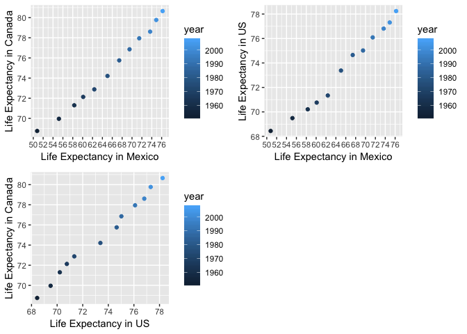

Alejandra\_hw04\_tidy\_data\_joins
================

## Tidy data and joins

This is an R Markdown document that has the objective of practicing and
strengthen data wrangling skills by working with some realistic problems
in the grey area between data aggregation and data reshaping.

According to Hadley Wickham, **Data Tidying** is structuring datasets to
facilitate analysis.

## Loading data and required libraries

``` r
library(gapminder)
library(dplyr)
library(tidyr)
library(kableExtra)
library(gridExtra)
library(ggplot2)
```

**Data Reshaping Prompts (and relationship to aggregation)**

Using `gather()` and `spread()` functions to reshape data can be very
useful to present tables, figures or doing aggregations and statistical
analysis.

\#\# Activity 2:

  - Make a tibble with one row per year and columns for life expectancy
    for two or more countries.

\-Use knitr::kable() to make this table look pretty in your rendered
homework. -Take advantage of this new data shape to scatterplot life
expectancy for one country against that of another.

For this activity, I will select the countries from North America:
Mexico, United States and Canada.

First let’s only look at the subset of life expectancy in these
countries:

``` r
#subset data from North America
NAmerica = gapminder %>%
  filter(country %in% c("Mexico", "United States", "Canada")) %>% 
  select(country, year, lifeExp)
  
#Put the subset in a table
  kable (NAmerica) %>%
  kable_styling(full_width = FALSE, position = "center")
```

<table class="table" style="width: auto !important; margin-left: auto; margin-right: auto;">

<thead>

<tr>

<th style="text-align:left;">

country

</th>

<th style="text-align:right;">

year

</th>

<th style="text-align:right;">

lifeExp

</th>

</tr>

</thead>

<tbody>

<tr>

<td style="text-align:left;">

Canada

</td>

<td style="text-align:right;">

1952

</td>

<td style="text-align:right;">

68.750

</td>

</tr>

<tr>

<td style="text-align:left;">

Canada

</td>

<td style="text-align:right;">

1957

</td>

<td style="text-align:right;">

69.960

</td>

</tr>

<tr>

<td style="text-align:left;">

Canada

</td>

<td style="text-align:right;">

1962

</td>

<td style="text-align:right;">

71.300

</td>

</tr>

<tr>

<td style="text-align:left;">

Canada

</td>

<td style="text-align:right;">

1967

</td>

<td style="text-align:right;">

72.130

</td>

</tr>

<tr>

<td style="text-align:left;">

Canada

</td>

<td style="text-align:right;">

1972

</td>

<td style="text-align:right;">

72.880

</td>

</tr>

<tr>

<td style="text-align:left;">

Canada

</td>

<td style="text-align:right;">

1977

</td>

<td style="text-align:right;">

74.210

</td>

</tr>

<tr>

<td style="text-align:left;">

Canada

</td>

<td style="text-align:right;">

1982

</td>

<td style="text-align:right;">

75.760

</td>

</tr>

<tr>

<td style="text-align:left;">

Canada

</td>

<td style="text-align:right;">

1987

</td>

<td style="text-align:right;">

76.860

</td>

</tr>

<tr>

<td style="text-align:left;">

Canada

</td>

<td style="text-align:right;">

1992

</td>

<td style="text-align:right;">

77.950

</td>

</tr>

<tr>

<td style="text-align:left;">

Canada

</td>

<td style="text-align:right;">

1997

</td>

<td style="text-align:right;">

78.610

</td>

</tr>

<tr>

<td style="text-align:left;">

Canada

</td>

<td style="text-align:right;">

2002

</td>

<td style="text-align:right;">

79.770

</td>

</tr>

<tr>

<td style="text-align:left;">

Canada

</td>

<td style="text-align:right;">

2007

</td>

<td style="text-align:right;">

80.653

</td>

</tr>

<tr>

<td style="text-align:left;">

Mexico

</td>

<td style="text-align:right;">

1952

</td>

<td style="text-align:right;">

50.789

</td>

</tr>

<tr>

<td style="text-align:left;">

Mexico

</td>

<td style="text-align:right;">

1957

</td>

<td style="text-align:right;">

55.190

</td>

</tr>

<tr>

<td style="text-align:left;">

Mexico

</td>

<td style="text-align:right;">

1962

</td>

<td style="text-align:right;">

58.299

</td>

</tr>

<tr>

<td style="text-align:left;">

Mexico

</td>

<td style="text-align:right;">

1967

</td>

<td style="text-align:right;">

60.110

</td>

</tr>

<tr>

<td style="text-align:left;">

Mexico

</td>

<td style="text-align:right;">

1972

</td>

<td style="text-align:right;">

62.361

</td>

</tr>

<tr>

<td style="text-align:left;">

Mexico

</td>

<td style="text-align:right;">

1977

</td>

<td style="text-align:right;">

65.032

</td>

</tr>

<tr>

<td style="text-align:left;">

Mexico

</td>

<td style="text-align:right;">

1982

</td>

<td style="text-align:right;">

67.405

</td>

</tr>

<tr>

<td style="text-align:left;">

Mexico

</td>

<td style="text-align:right;">

1987

</td>

<td style="text-align:right;">

69.498

</td>

</tr>

<tr>

<td style="text-align:left;">

Mexico

</td>

<td style="text-align:right;">

1992

</td>

<td style="text-align:right;">

71.455

</td>

</tr>

<tr>

<td style="text-align:left;">

Mexico

</td>

<td style="text-align:right;">

1997

</td>

<td style="text-align:right;">

73.670

</td>

</tr>

<tr>

<td style="text-align:left;">

Mexico

</td>

<td style="text-align:right;">

2002

</td>

<td style="text-align:right;">

74.902

</td>

</tr>

<tr>

<td style="text-align:left;">

Mexico

</td>

<td style="text-align:right;">

2007

</td>

<td style="text-align:right;">

76.195

</td>

</tr>

<tr>

<td style="text-align:left;">

United States

</td>

<td style="text-align:right;">

1952

</td>

<td style="text-align:right;">

68.440

</td>

</tr>

<tr>

<td style="text-align:left;">

United States

</td>

<td style="text-align:right;">

1957

</td>

<td style="text-align:right;">

69.490

</td>

</tr>

<tr>

<td style="text-align:left;">

United States

</td>

<td style="text-align:right;">

1962

</td>

<td style="text-align:right;">

70.210

</td>

</tr>

<tr>

<td style="text-align:left;">

United States

</td>

<td style="text-align:right;">

1967

</td>

<td style="text-align:right;">

70.760

</td>

</tr>

<tr>

<td style="text-align:left;">

United States

</td>

<td style="text-align:right;">

1972

</td>

<td style="text-align:right;">

71.340

</td>

</tr>

<tr>

<td style="text-align:left;">

United States

</td>

<td style="text-align:right;">

1977

</td>

<td style="text-align:right;">

73.380

</td>

</tr>

<tr>

<td style="text-align:left;">

United States

</td>

<td style="text-align:right;">

1982

</td>

<td style="text-align:right;">

74.650

</td>

</tr>

<tr>

<td style="text-align:left;">

United States

</td>

<td style="text-align:right;">

1987

</td>

<td style="text-align:right;">

75.020

</td>

</tr>

<tr>

<td style="text-align:left;">

United States

</td>

<td style="text-align:right;">

1992

</td>

<td style="text-align:right;">

76.090

</td>

</tr>

<tr>

<td style="text-align:left;">

United States

</td>

<td style="text-align:right;">

1997

</td>

<td style="text-align:right;">

76.810

</td>

</tr>

<tr>

<td style="text-align:left;">

United States

</td>

<td style="text-align:right;">

2002

</td>

<td style="text-align:right;">

77.310

</td>

</tr>

<tr>

<td style="text-align:left;">

United States

</td>

<td style="text-align:right;">

2007

</td>

<td style="text-align:right;">

78.242

</td>

</tr>

</tbody>

</table>

Now, let’s make the data tidy by using `spread()` which turns a pair of
key-values into tidy columns. I will put the outpu in a table and I will
also make a plot with this new tidy data.

``` r
NAtable = NAmerica %>%
spread(key = country, value = lifeExp) #define key value pairs for new columns

NAplot = NAmerica %>%
  ggplot(aes(year, lifeExp, color = country)) +
  geom_point() +
  geom_line() +
  labs(x="Year", y="Life Expectancy", title= "Life Expectancy in North America") #add axis labels and title

grid.arrange(tableGrob(NAtable), NAplot, nrow = 1) #put table next to plot
```


`spread()` allowed tidying data by making a column for each conytry and
each observation in a row. This made it possible to do the above plot
easily. We can see that in early years, there was a huge gap between the
life expectancy of Mexico and the rest of North America. However, over
the years, life expectancy in Mexico increased and in 2007 it was not
too far behind from United States and Canada.

Now let’s compare life expectancy between US and Canada by making a
scatterplot:

``` r
g1 <- NAtable %>%
  ggplot(aes(x=Mexico, y=Canada)) +
  geom_point(aes(color= year)) +
  scale_y_continuous(breaks = seq(0,85,by=2)) + #adjust axis to read plot easier
  scale_x_continuous(breaks = seq(0,85,by=2)) +
  labs(x= "Life Expectancy in Mexico", y= "Life Expectancy in Canada") #change axis labels
  
g2 <- NAtable %>%
  ggplot(aes(x=Mexico, y=`United States`)) +
  geom_point(aes(color= year)) +
  scale_y_continuous(breaks = seq(0,85,by=2)) + #adjust axis to read plot easier
  scale_x_continuous(breaks = seq(0,85,by=2)) +
  labs(x= "Life Expectancy in Mexico", y= "Life Expectancy in US")
  
g3 <- NAtable %>%
  ggplot(aes(x=`United States`, y=Canada)) +
  geom_point(aes(color= year)) +
  scale_y_continuous(breaks = seq(0,85,by=2)) + #adjust axis to read plot easier
  scale_x_continuous(breaks = seq(0,85,by=2)) +
  labs(x= "Life Expectancy in US", y= "Life Expectancy in Canada")
  
grid.arrange(g1, g2, g3, nrow=2)
```

<!-- -->

With the tidy data, we can compare life expectancy between countries in
North America. In 1952, life expectancy in Mexico differed more than 15
years compared to Canada and the US, and with time that difference
decreased. In 2007, the difference between Mexico and the other two
countries was less than 5 years.

## Activity 3: Compute a measure of life expectancy

\-Compute some measure of life expectancy for all possible combinations
of continent and year. Reshape that to have one row per year and one
variable for each continent. Or the other way around: one row per
continent and one variable per year.

\-Use knitr::kable() to make these tables look pretty in your rendered
homework.

\-Is there a plot that is easier to make with the data in this shape
versis the usual form? If so (or you think so), try it\! Reflect.

For this task, I will look at the maximum values of life expectancy in
continents throughout the year. First, let’s look at the subset of this
value without tidying yet:

``` r
Max_LE=gapminder %>%
  group_by(year, continent) %>%
  summarize(max_lifeExp=max(lifeExp)) # Calculate the maximum value of life expectancy
  
kable(Max_LE) %>%
kable_styling(full_width = FALSE, position = "center")
```

<table class="table" style="width: auto !important; margin-left: auto; margin-right: auto;">

<thead>

<tr>

<th style="text-align:right;">

year

</th>

<th style="text-align:left;">

continent

</th>

<th style="text-align:right;">

max\_lifeExp

</th>

</tr>

</thead>

<tbody>

<tr>

<td style="text-align:right;">

1952

</td>

<td style="text-align:left;">

Africa

</td>

<td style="text-align:right;">

52.724

</td>

</tr>

<tr>

<td style="text-align:right;">

1952

</td>

<td style="text-align:left;">

Americas

</td>

<td style="text-align:right;">

68.750

</td>

</tr>

<tr>

<td style="text-align:right;">

1952

</td>

<td style="text-align:left;">

Asia

</td>

<td style="text-align:right;">

65.390

</td>

</tr>

<tr>

<td style="text-align:right;">

1952

</td>

<td style="text-align:left;">

Europe

</td>

<td style="text-align:right;">

72.670

</td>

</tr>

<tr>

<td style="text-align:right;">

1952

</td>

<td style="text-align:left;">

Oceania

</td>

<td style="text-align:right;">

69.390

</td>

</tr>

<tr>

<td style="text-align:right;">

1957

</td>

<td style="text-align:left;">

Africa

</td>

<td style="text-align:right;">

58.089

</td>

</tr>

<tr>

<td style="text-align:right;">

1957

</td>

<td style="text-align:left;">

Americas

</td>

<td style="text-align:right;">

69.960

</td>

</tr>

<tr>

<td style="text-align:right;">

1957

</td>

<td style="text-align:left;">

Asia

</td>

<td style="text-align:right;">

67.840

</td>

</tr>

<tr>

<td style="text-align:right;">

1957

</td>

<td style="text-align:left;">

Europe

</td>

<td style="text-align:right;">

73.470

</td>

</tr>

<tr>

<td style="text-align:right;">

1957

</td>

<td style="text-align:left;">

Oceania

</td>

<td style="text-align:right;">

70.330

</td>

</tr>

<tr>

<td style="text-align:right;">

1962

</td>

<td style="text-align:left;">

Africa

</td>

<td style="text-align:right;">

60.246

</td>

</tr>

<tr>

<td style="text-align:right;">

1962

</td>

<td style="text-align:left;">

Americas

</td>

<td style="text-align:right;">

71.300

</td>

</tr>

<tr>

<td style="text-align:right;">

1962

</td>

<td style="text-align:left;">

Asia

</td>

<td style="text-align:right;">

69.390

</td>

</tr>

<tr>

<td style="text-align:right;">

1962

</td>

<td style="text-align:left;">

Europe

</td>

<td style="text-align:right;">

73.680

</td>

</tr>

<tr>

<td style="text-align:right;">

1962

</td>

<td style="text-align:left;">

Oceania

</td>

<td style="text-align:right;">

71.240

</td>

</tr>

<tr>

<td style="text-align:right;">

1967

</td>

<td style="text-align:left;">

Africa

</td>

<td style="text-align:right;">

61.557

</td>

</tr>

<tr>

<td style="text-align:right;">

1967

</td>

<td style="text-align:left;">

Americas

</td>

<td style="text-align:right;">

72.130

</td>

</tr>

<tr>

<td style="text-align:right;">

1967

</td>

<td style="text-align:left;">

Asia

</td>

<td style="text-align:right;">

71.430

</td>

</tr>

<tr>

<td style="text-align:right;">

1967

</td>

<td style="text-align:left;">

Europe

</td>

<td style="text-align:right;">

74.160

</td>

</tr>

<tr>

<td style="text-align:right;">

1967

</td>

<td style="text-align:left;">

Oceania

</td>

<td style="text-align:right;">

71.520

</td>

</tr>

<tr>

<td style="text-align:right;">

1972

</td>

<td style="text-align:left;">

Africa

</td>

<td style="text-align:right;">

64.274

</td>

</tr>

<tr>

<td style="text-align:right;">

1972

</td>

<td style="text-align:left;">

Americas

</td>

<td style="text-align:right;">

72.880

</td>

</tr>

<tr>

<td style="text-align:right;">

1972

</td>

<td style="text-align:left;">

Asia

</td>

<td style="text-align:right;">

73.420

</td>

</tr>

<tr>

<td style="text-align:right;">

1972

</td>

<td style="text-align:left;">

Europe

</td>

<td style="text-align:right;">

74.720

</td>

</tr>

<tr>

<td style="text-align:right;">

1972

</td>

<td style="text-align:left;">

Oceania

</td>

<td style="text-align:right;">

71.930

</td>

</tr>

<tr>

<td style="text-align:right;">

1977

</td>

<td style="text-align:left;">

Africa

</td>

<td style="text-align:right;">

67.064

</td>

</tr>

<tr>

<td style="text-align:right;">

1977

</td>

<td style="text-align:left;">

Americas

</td>

<td style="text-align:right;">

74.210

</td>

</tr>

<tr>

<td style="text-align:right;">

1977

</td>

<td style="text-align:left;">

Asia

</td>

<td style="text-align:right;">

75.380

</td>

</tr>

<tr>

<td style="text-align:right;">

1977

</td>

<td style="text-align:left;">

Europe

</td>

<td style="text-align:right;">

76.110

</td>

</tr>

<tr>

<td style="text-align:right;">

1977

</td>

<td style="text-align:left;">

Oceania

</td>

<td style="text-align:right;">

73.490

</td>

</tr>

<tr>

<td style="text-align:right;">

1982

</td>

<td style="text-align:left;">

Africa

</td>

<td style="text-align:right;">

69.885

</td>

</tr>

<tr>

<td style="text-align:right;">

1982

</td>

<td style="text-align:left;">

Americas

</td>

<td style="text-align:right;">

75.760

</td>

</tr>

<tr>

<td style="text-align:right;">

1982

</td>

<td style="text-align:left;">

Asia

</td>

<td style="text-align:right;">

77.110

</td>

</tr>

<tr>

<td style="text-align:right;">

1982

</td>

<td style="text-align:left;">

Europe

</td>

<td style="text-align:right;">

76.990

</td>

</tr>

<tr>

<td style="text-align:right;">

1982

</td>

<td style="text-align:left;">

Oceania

</td>

<td style="text-align:right;">

74.740

</td>

</tr>

<tr>

<td style="text-align:right;">

1987

</td>

<td style="text-align:left;">

Africa

</td>

<td style="text-align:right;">

71.913

</td>

</tr>

<tr>

<td style="text-align:right;">

1987

</td>

<td style="text-align:left;">

Americas

</td>

<td style="text-align:right;">

76.860

</td>

</tr>

<tr>

<td style="text-align:right;">

1987

</td>

<td style="text-align:left;">

Asia

</td>

<td style="text-align:right;">

78.670

</td>

</tr>

<tr>

<td style="text-align:right;">

1987

</td>

<td style="text-align:left;">

Europe

</td>

<td style="text-align:right;">

77.410

</td>

</tr>

<tr>

<td style="text-align:right;">

1987

</td>

<td style="text-align:left;">

Oceania

</td>

<td style="text-align:right;">

76.320

</td>

</tr>

<tr>

<td style="text-align:right;">

1992

</td>

<td style="text-align:left;">

Africa

</td>

<td style="text-align:right;">

73.615

</td>

</tr>

<tr>

<td style="text-align:right;">

1992

</td>

<td style="text-align:left;">

Americas

</td>

<td style="text-align:right;">

77.950

</td>

</tr>

<tr>

<td style="text-align:right;">

1992

</td>

<td style="text-align:left;">

Asia

</td>

<td style="text-align:right;">

79.360

</td>

</tr>

<tr>

<td style="text-align:right;">

1992

</td>

<td style="text-align:left;">

Europe

</td>

<td style="text-align:right;">

78.770

</td>

</tr>

<tr>

<td style="text-align:right;">

1992

</td>

<td style="text-align:left;">

Oceania

</td>

<td style="text-align:right;">

77.560

</td>

</tr>

<tr>

<td style="text-align:right;">

1997

</td>

<td style="text-align:left;">

Africa

</td>

<td style="text-align:right;">

74.772

</td>

</tr>

<tr>

<td style="text-align:right;">

1997

</td>

<td style="text-align:left;">

Americas

</td>

<td style="text-align:right;">

78.610

</td>

</tr>

<tr>

<td style="text-align:right;">

1997

</td>

<td style="text-align:left;">

Asia

</td>

<td style="text-align:right;">

80.690

</td>

</tr>

<tr>

<td style="text-align:right;">

1997

</td>

<td style="text-align:left;">

Europe

</td>

<td style="text-align:right;">

79.390

</td>

</tr>

<tr>

<td style="text-align:right;">

1997

</td>

<td style="text-align:left;">

Oceania

</td>

<td style="text-align:right;">

78.830

</td>

</tr>

<tr>

<td style="text-align:right;">

2002

</td>

<td style="text-align:left;">

Africa

</td>

<td style="text-align:right;">

75.744

</td>

</tr>

<tr>

<td style="text-align:right;">

2002

</td>

<td style="text-align:left;">

Americas

</td>

<td style="text-align:right;">

79.770

</td>

</tr>

<tr>

<td style="text-align:right;">

2002

</td>

<td style="text-align:left;">

Asia

</td>

<td style="text-align:right;">

82.000

</td>

</tr>

<tr>

<td style="text-align:right;">

2002

</td>

<td style="text-align:left;">

Europe

</td>

<td style="text-align:right;">

80.620

</td>

</tr>

<tr>

<td style="text-align:right;">

2002

</td>

<td style="text-align:left;">

Oceania

</td>

<td style="text-align:right;">

80.370

</td>

</tr>

<tr>

<td style="text-align:right;">

2007

</td>

<td style="text-align:left;">

Africa

</td>

<td style="text-align:right;">

76.442

</td>

</tr>

<tr>

<td style="text-align:right;">

2007

</td>

<td style="text-align:left;">

Americas

</td>

<td style="text-align:right;">

80.653

</td>

</tr>

<tr>

<td style="text-align:right;">

2007

</td>

<td style="text-align:left;">

Asia

</td>

<td style="text-align:right;">

82.603

</td>

</tr>

<tr>

<td style="text-align:right;">

2007

</td>

<td style="text-align:left;">

Europe

</td>

<td style="text-align:right;">

81.757

</td>

</tr>

<tr>

<td style="text-align:right;">

2007

</td>

<td style="text-align:left;">

Oceania

</td>

<td style="text-align:right;">

81.235

</td>

</tr>

</tbody>

</table>

Now, let’s reshape the subset above turning each continent into a
variable and having one row per year:

``` r
tidy_continent=Max_LE %>%
spread(key = continent, value= max_lifeExp)

kable(tidy_continent) %>%
  kable_styling(full_width = FALSE, position = "center")
```

<table class="table" style="width: auto !important; margin-left: auto; margin-right: auto;">

<thead>

<tr>

<th style="text-align:right;">

year

</th>

<th style="text-align:right;">

Africa

</th>

<th style="text-align:right;">

Americas

</th>

<th style="text-align:right;">

Asia

</th>

<th style="text-align:right;">

Europe

</th>

<th style="text-align:right;">

Oceania

</th>

</tr>

</thead>

<tbody>

<tr>

<td style="text-align:right;">

1952

</td>

<td style="text-align:right;">

52.724

</td>

<td style="text-align:right;">

68.750

</td>

<td style="text-align:right;">

65.390

</td>

<td style="text-align:right;">

72.670

</td>

<td style="text-align:right;">

69.390

</td>

</tr>

<tr>

<td style="text-align:right;">

1957

</td>

<td style="text-align:right;">

58.089

</td>

<td style="text-align:right;">

69.960

</td>

<td style="text-align:right;">

67.840

</td>

<td style="text-align:right;">

73.470

</td>

<td style="text-align:right;">

70.330

</td>

</tr>

<tr>

<td style="text-align:right;">

1962

</td>

<td style="text-align:right;">

60.246

</td>

<td style="text-align:right;">

71.300

</td>

<td style="text-align:right;">

69.390

</td>

<td style="text-align:right;">

73.680

</td>

<td style="text-align:right;">

71.240

</td>

</tr>

<tr>

<td style="text-align:right;">

1967

</td>

<td style="text-align:right;">

61.557

</td>

<td style="text-align:right;">

72.130

</td>

<td style="text-align:right;">

71.430

</td>

<td style="text-align:right;">

74.160

</td>

<td style="text-align:right;">

71.520

</td>

</tr>

<tr>

<td style="text-align:right;">

1972

</td>

<td style="text-align:right;">

64.274

</td>

<td style="text-align:right;">

72.880

</td>

<td style="text-align:right;">

73.420

</td>

<td style="text-align:right;">

74.720

</td>

<td style="text-align:right;">

71.930

</td>

</tr>

<tr>

<td style="text-align:right;">

1977

</td>

<td style="text-align:right;">

67.064

</td>

<td style="text-align:right;">

74.210

</td>

<td style="text-align:right;">

75.380

</td>

<td style="text-align:right;">

76.110

</td>

<td style="text-align:right;">

73.490

</td>

</tr>

<tr>

<td style="text-align:right;">

1982

</td>

<td style="text-align:right;">

69.885

</td>

<td style="text-align:right;">

75.760

</td>

<td style="text-align:right;">

77.110

</td>

<td style="text-align:right;">

76.990

</td>

<td style="text-align:right;">

74.740

</td>

</tr>

<tr>

<td style="text-align:right;">

1987

</td>

<td style="text-align:right;">

71.913

</td>

<td style="text-align:right;">

76.860

</td>

<td style="text-align:right;">

78.670

</td>

<td style="text-align:right;">

77.410

</td>

<td style="text-align:right;">

76.320

</td>

</tr>

<tr>

<td style="text-align:right;">

1992

</td>

<td style="text-align:right;">

73.615

</td>

<td style="text-align:right;">

77.950

</td>

<td style="text-align:right;">

79.360

</td>

<td style="text-align:right;">

78.770

</td>

<td style="text-align:right;">

77.560

</td>

</tr>

<tr>

<td style="text-align:right;">

1997

</td>

<td style="text-align:right;">

74.772

</td>

<td style="text-align:right;">

78.610

</td>

<td style="text-align:right;">

80.690

</td>

<td style="text-align:right;">

79.390

</td>

<td style="text-align:right;">

78.830

</td>

</tr>

<tr>

<td style="text-align:right;">

2002

</td>

<td style="text-align:right;">

75.744

</td>

<td style="text-align:right;">

79.770

</td>

<td style="text-align:right;">

82.000

</td>

<td style="text-align:right;">

80.620

</td>

<td style="text-align:right;">

80.370

</td>

</tr>

<tr>

<td style="text-align:right;">

2007

</td>

<td style="text-align:right;">

76.442

</td>

<td style="text-align:right;">

80.653

</td>

<td style="text-align:right;">

82.603

</td>

<td style="text-align:right;">

81.757

</td>

<td style="text-align:right;">

81.235

</td>

</tr>

</tbody>

</table>

With this arrangement, we can compare for example the maximum values of
life expectancy between two continents for the 12 years of data as
follows:

``` r
tidy_continent %>%
  ggplot()+
  geom_point(aes(Africa, Europe, color = factor(year)))+
  scale_y_continuous(breaks = seq(0,90,by=2)) + #adjust axis scale and breaks
  scale_x_continuous(breaks = seq(0,80,by=2)) +
  labs(x= "Maximum Life Expectancy in Africa", y="Maximum Life Expectancy in Europe")
```

<!-- -->

In the plot above, we can see how Europe’s maximum value of life
expectancy has ranged from 72 to 82, whilst Africa’s has a wider range:
between 52 and 77.

I can also arrange the data the other way around, making one row per
continent and one variable per year.

``` r
tidy_year=Max_LE%>%
  spread(key=year, value=max_lifeExp)

tidy_year%>%  
  kable() %>%
  kable_styling(full_width = FALSE, position = "center")
```

<table class="table" style="width: auto !important; margin-left: auto; margin-right: auto;">

<thead>

<tr>

<th style="text-align:left;">

continent

</th>

<th style="text-align:right;">

1952

</th>

<th style="text-align:right;">

1957

</th>

<th style="text-align:right;">

1962

</th>

<th style="text-align:right;">

1967

</th>

<th style="text-align:right;">

1972

</th>

<th style="text-align:right;">

1977

</th>

<th style="text-align:right;">

1982

</th>

<th style="text-align:right;">

1987

</th>

<th style="text-align:right;">

1992

</th>

<th style="text-align:right;">

1997

</th>

<th style="text-align:right;">

2002

</th>

<th style="text-align:right;">

2007

</th>

</tr>

</thead>

<tbody>

<tr>

<td style="text-align:left;">

Africa

</td>

<td style="text-align:right;">

52.724

</td>

<td style="text-align:right;">

58.089

</td>

<td style="text-align:right;">

60.246

</td>

<td style="text-align:right;">

61.557

</td>

<td style="text-align:right;">

64.274

</td>

<td style="text-align:right;">

67.064

</td>

<td style="text-align:right;">

69.885

</td>

<td style="text-align:right;">

71.913

</td>

<td style="text-align:right;">

73.615

</td>

<td style="text-align:right;">

74.772

</td>

<td style="text-align:right;">

75.744

</td>

<td style="text-align:right;">

76.442

</td>

</tr>

<tr>

<td style="text-align:left;">

Americas

</td>

<td style="text-align:right;">

68.750

</td>

<td style="text-align:right;">

69.960

</td>

<td style="text-align:right;">

71.300

</td>

<td style="text-align:right;">

72.130

</td>

<td style="text-align:right;">

72.880

</td>

<td style="text-align:right;">

74.210

</td>

<td style="text-align:right;">

75.760

</td>

<td style="text-align:right;">

76.860

</td>

<td style="text-align:right;">

77.950

</td>

<td style="text-align:right;">

78.610

</td>

<td style="text-align:right;">

79.770

</td>

<td style="text-align:right;">

80.653

</td>

</tr>

<tr>

<td style="text-align:left;">

Asia

</td>

<td style="text-align:right;">

65.390

</td>

<td style="text-align:right;">

67.840

</td>

<td style="text-align:right;">

69.390

</td>

<td style="text-align:right;">

71.430

</td>

<td style="text-align:right;">

73.420

</td>

<td style="text-align:right;">

75.380

</td>

<td style="text-align:right;">

77.110

</td>

<td style="text-align:right;">

78.670

</td>

<td style="text-align:right;">

79.360

</td>

<td style="text-align:right;">

80.690

</td>

<td style="text-align:right;">

82.000

</td>

<td style="text-align:right;">

82.603

</td>

</tr>

<tr>

<td style="text-align:left;">

Europe

</td>

<td style="text-align:right;">

72.670

</td>

<td style="text-align:right;">

73.470

</td>

<td style="text-align:right;">

73.680

</td>

<td style="text-align:right;">

74.160

</td>

<td style="text-align:right;">

74.720

</td>

<td style="text-align:right;">

76.110

</td>

<td style="text-align:right;">

76.990

</td>

<td style="text-align:right;">

77.410

</td>

<td style="text-align:right;">

78.770

</td>

<td style="text-align:right;">

79.390

</td>

<td style="text-align:right;">

80.620

</td>

<td style="text-align:right;">

81.757

</td>

</tr>

<tr>

<td style="text-align:left;">

Oceania

</td>

<td style="text-align:right;">

69.390

</td>

<td style="text-align:right;">

70.330

</td>

<td style="text-align:right;">

71.240

</td>

<td style="text-align:right;">

71.520

</td>

<td style="text-align:right;">

71.930

</td>

<td style="text-align:right;">

73.490

</td>

<td style="text-align:right;">

74.740

</td>

<td style="text-align:right;">

76.320

</td>

<td style="text-align:right;">

77.560

</td>

<td style="text-align:right;">

78.830

</td>

<td style="text-align:right;">

80.370

</td>

<td style="text-align:right;">

81.235

</td>

</tr>

</tbody>

</table>

This allows to compare two years of data, for example:

``` r
tidy_year %>%
  ggplot()+
  geom_point(aes(`2007`, `1997`, color = continent)) +
  scale_y_continuous(breaks = seq(0,90,by=0.5)) + #adjust axis scale and breaks
  scale_x_continuous(breaks = seq(0,90,by=0.5)) +
  labs(x= "Maximum Life Expectancy in 2007", y="Maximum Life Expectancy in 1997")
```

<!-- -->

The plot shows how the maximum value of life expectancy changed in 10
years for the 5 continents. In general, they all increased over this
period of time.
